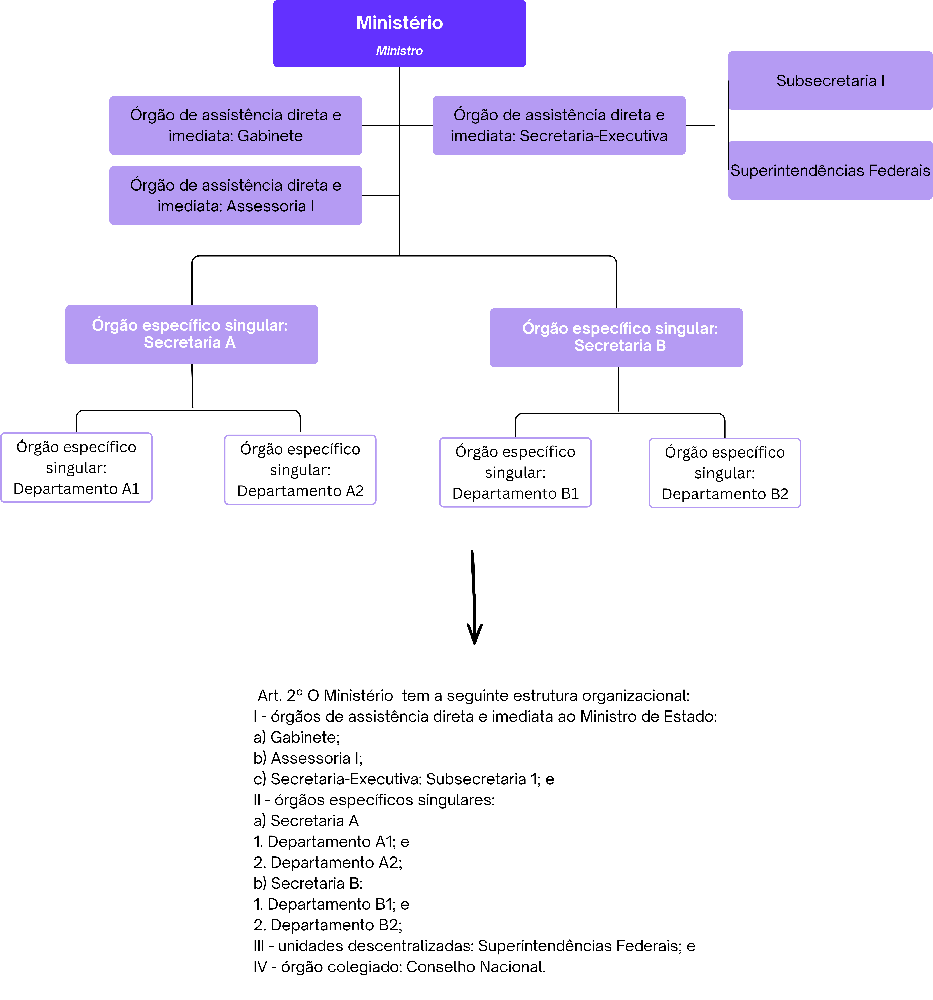

Alteração de estruturas regimentais de órgãos da Presidência da República e dos Ministérios - Anexo I
=====================================================================================================

Esta seção aborda como elaborar estruturas regimentais de órgãos da Presidência da
República e dos Ministérios. A estrutura regimental ocupa o Anexo I de um decreto
de estrutura.

Unidades e competências obrigatórias
------------------------------------
As :ref:`competencias` de cada órgão são definidas pela
`Lei nº 14.600, de 19 de junho de 2023 <lei-14600_>`_,
que organiza a Administração Pública federal, usualmente publicada no início do
governo em exercício na forma de medida provisória.

Propostas de alteração de estrutura devem, inicialmente, observar essa lei quanto:
 
* às competências do órgão, que devem ser replicadas no art. 1º do Anexo I do
  decreto que aprova sua estrutura regimental e que devem nortear as competências
  de todas as outras unidades subordinadas. Esse é o único artigo que compõe o
  Capítulo I: Da natureza e da competência.
 
* às unidades obrigatórias e regramentos específicos a serem observados no desenho
  da estrutura organizacional, inclusive quanto ao limite de Secretarias em cada
  Ministério.

O `art. 50 da Lei nº 14.600, de 19 de junho de 2023 <lei-14600-art50_>`_ determina que são obrigatórias
as seguintes unidades:
 
* Gabinete do Ministro;
* Secretaria-Executiva, exceto no Ministério da Defesa e no Ministério das Relações
  Exteriores;
* Consultoria Jurídica;
* Ouvidoria;
* Secretarias; e
* órgão responsável pelas atividades de administração patrimonial, de material, de
  gestão de pessoas, de serviços gerais, de orçamento e finanças, de contabilidade
  e de tecnologia da informação, vinculado à Secretaria-Executiva.

Para essas e todas as demais unidades que compõem o órgão, o
`Decreto nº 10.829, de 5 de outubro de 2021 <decreto-10829_>`_ determina a
necessidade de definição das competências no decreto de estrutura:
 
.. admonition:: Decreto nº 10.829, de 5 de outubro de 2021 — art. 5º
 
   Art. 5º  O decreto que aprovar a estrutura regimental ou o estatuto do órgão ou
   da entidade deverá discriminar, em anexo específico:
 
   I - as competências do órgão e de suas secretarias, ou equivalentes, quando se
   tratar da administração pública direta; e
 
   (...)
 
   § 1º  A discriminação de que trata o *caput* poderá ser estendida às demais
   unidades administrativas, até o limite de CCE ou FCE de nível 15, observadas
   as competências e as especificidades do órgão ou da entidade.

Atualmente, convencionou-se descrever as competências de todas as unidades de nível
15 ou superior (nível de diretoria ou departamento).
 
 
Quando as unidades estiverem subordinadas diretamente ao Ministro, entende-se que
são equivalentes às Secretarias, independentemente de seu nível, cabendo também a
discriminação de suas competências. São exemplos de unidades dessa natureza a
Ouvidoria, a Corregedoria e as Assessorias que não compõem o Gabinete do Ministro.
 
.. TODO: inserir referência à tabela de níveis associados a cada unidade
 
Assim, se a proposta cria ou extingue alguma unidade com essas características,
será necessário inserir ou excluir suas competências.
 
.. warning::
 
   A não ser que haja previsão legal, fique atento para que a proposta não traga
   alterações que gerem sombreamento de competências com outros órgãos.
 
Organização básica e elementos da estrutura regimental
------------------------------------------------------
 
A organização do Anexo I segue os princípios do
`Decreto nº 12.002, de 22 de abril de 2024 <decreto-12002_>`_, que estabelece as
normas gerais para elaboração, redação, alteração e consolidação de atos normativos.
Todos esses princípios devem ser observados também em propostas de alteração de
estruturas regimentais.
 
.. note::
 
   O `Decreto nº 12.002, de 22 de abril de 2024 <decreto-12002_>`_ permite compreender como estruturar
   um ato normativo, o que deve ser observado em sua redação para manter clareza,
   precisão e ordem lógica, a formatação (espaçamentos, uso de negritos e itálicos)
   e as regras para alterações e revogações.
 
   .. TODO: inserir links para as seções específicas do decreto

No caso das estruturas, a divisão do texto que trata da estrutura regimental segue
a seguinte lógica:
 
.. admonition:: Capítulo I: DA NATUREZA E DA COMPETÊNCIA
 
   Por padrão, abrange somente o art. 1º, que traz as competências do órgão:
 
   "Art. 1º  O [*nome do órgão*], órgão da administração pública federal direta,
   tem como área de competência os seguintes assuntos:
 
   [competências idênticas às constantes na `Lei nº 14.600, de 19 de junho de 2023 <lei-14600_>`_]"
 
.. admonition:: Capítulo II: DA ESTRUTURA ORGANIZACIONAL
 
   Por padrão, abrange somente o art. 2º, que traz a organização interna do órgão,
   dividida da seguinte forma:
 
   I - órgãos de assistência direta e imediata ao Ministro de Estado: engloba todas
   as unidades de assessoria direta (começando pelo Gabinete do Ministro e seguindo
   com suas Assessorias Especiais), unidades setoriais (Ouvidoria, Corregedoria,
   Consultoria Jurídica) e a Secretaria-Executiva, com suas Subsecretarias.
 
   II - órgãos específicos singulares: engloba as unidades finalísticas do órgão,
   ou seja, as Secretarias e suas Diretorias ou Departamentos.
 
   III - unidades descentralizadas (se houver): engloba todas as unidades situadas
   em município distinto ao da sede do órgão.
 
   IV - órgãos colegiados (se houver): engloba colegiados criados por lei, sob
   responsabilidade do órgão.
 
   V - entidades vinculadas (se houver): engloba autarquias, fundações públicas
   e empresas públicas vinculadas ao órgão.

Exemplo simplificado
~~~~~~~~~~~~~~~~~~~~
 
.. _organograma-ministerio:

 
   Organograma simplificado de ministério.
 
.. admonition:: Capítulo III: DAS COMPETÊNCIAS DOS ÓRGÃOS
 
   Esse capítulo descreve as competências de todas as unidades organizacionais
   elencadas no art. 2º, na exata ordem em que lá aparecem. Para cada grupo de
   unidades, haverá uma Seção específica. Para cada unidade organizacional,
   haverá um artigo.
 
.. note::
 
   A redação de competências segue as regras e boas práticas definidas no
   `Decreto nº 12.002, de 22 de abril de 2024 <decreto-12002_>`_.
 
   Todas as unidades setoriais têm suas atribuições gerais estabelecidas por normas
   específicas e, em alguns casos, a redação de suas competências foi padronizada
   pelo órgão central do sistema.

Como o Gabinete do Ministro é uma unidade obrigatória em todos os órgãos com status ministerial, conforme a `Lei nº 14.600, de 19 de junho de 2023 <lei-14600_>`_, o Capítulo III começa por ele.

.. admonition:: Exemplo
 
   Capítulo III: DAS COMPETÊNCIAS DOS ÓRGÃOS

   "**Seção I**
 
   **Dos órgãos de assistência direta e imediata ao Ministro de Estado X**
 
   Art. 3º  Ao Gabinete compete:
 
   I - xxx"
 
.. hint::
 
   Alterações pontuais de competências de unidades existentes serão feitas na forma
   de substituição do texto vigente. Por exemplo:
 
   "Art. 3º  O Anexo I ao Decreto nº [número do decreto com a estrutura vigente,
   com data], passa a vigorar com as seguintes alterações:
 
   "Art. 12.  .....................................................................................
 
   II - supervisionar, no âmbito do Ministério, as atividades de modernização
   administrativa;
   ........................................................................................................" (NR)
 
   Alterações pontuais que visem à criação de nova unidade serão feitas na forma de
   inserção de artigo, na ordem definida pela nova organização prevista no art. 2º.
 
   No exemplo de criação de nova unidade denominada Subsecretaria de Gestão
   Administrativa, subordinada à já existente Secretaria-Executiva, altera-se o
   art. 2º e incluem-se suas competências logo após as atualmente descritas para a
   Secretaria-Executiva (art. 12):
 
   "Art. 3º  O Anexo I ao Decreto nº [número do decreto com a estrutura vigente,
   com data], passa a vigorar com as seguintes alterações:
 
   "Art. 2º  .......................................
 
   I - ..............................................................
 
   j) Secretaria-Executiva: Subsecretaria de Gestão Administrativa;
   .....................................................................................\" (NR)
 
   "Art. 12-A  À Subsecretaria de Gestão Administrativa compete:
 
   I - assistir o Ministro de Estado na definição de diretrizes, na supervisão e na
   coordenação das atividades das Secretarias integrantes da estrutura do Ministério; e
 
   II - supervisionar, no âmbito do Ministério, as atividades de modernização
   administrativa."
 
   Nesse segundo exemplo, o quadro demonstrativo de cargos e funções (Anexo II)
   também é substituído, com a inclusão de novo bloco de cargos e funções.
 
   .. TODO: inserir link para a seção sobre o Anexo II
 
.. admonition:: Capítulo IV: DAS ATRIBUIÇÕES DOS DIRIGENTES
 
   Esse capítulo define as atribuições dos dirigentes do órgão.
 
.. admonition:: Em desenvolvimento
 
   O conteúdo relativo ao Capítulo IV será desenvolvido em versão posterior deste
   manual.
 
 
.. ---------------------------------------------------------------------------
.. Referências externas — legislação
.. ---------------------------------------------------------------------------
 
.. _lei-14600: https://www.planalto.gov.br/ccivil_03/_ato2023-2026/2023/lei/L14600.htm
.. _lei-14600-art50: https://www.planalto.gov.br/ccivil_03/_ato2023-2026/2023/lei/L14600.htm#Art50
.. _decreto-10829: https://www.planalto.gov.br/ccivil_03/_ato2019-2022/2021/decreto/D10829.htm
.. _decreto-12002: https://www.planalto.gov.br/ccivil_03/_ato2023-2026/2024/decreto/D12002.htm
