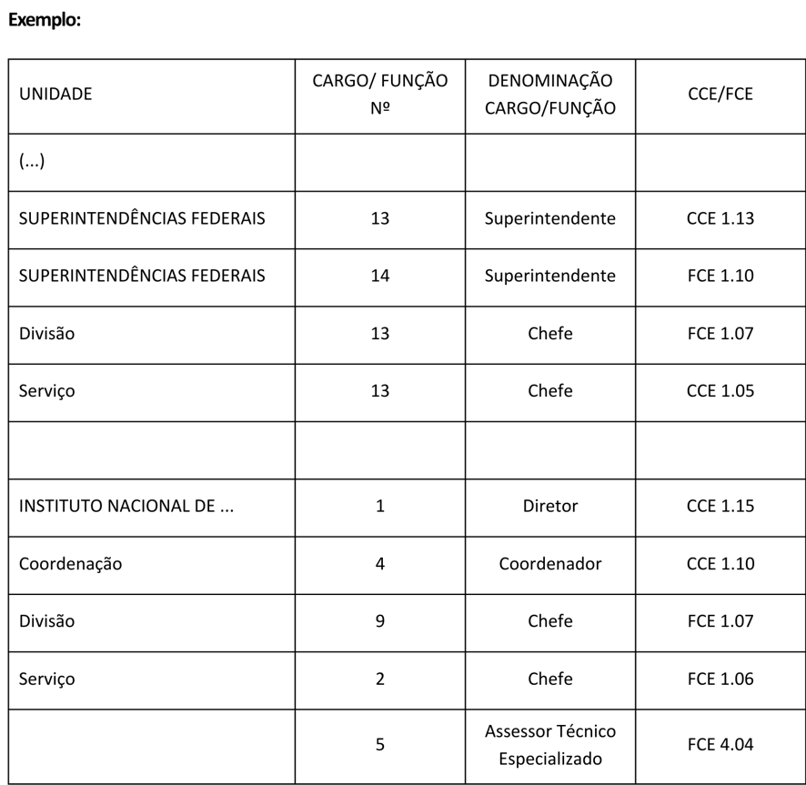

Conhecendo as unidades administrativas da administração direta e suas regras específicas
========================================================================================
 
As regras a seguir focam na estruturação hierárquica das unidades, chefiadas por
ocupantes de cargos e funções da categoria 1. No entanto, outros tipos de cargos
e funções (categorias 2, 3 e 4), que não são visíveis no organograma do órgão,
podem compor a estrutura de cada unidade.
 
A regra básica para definir se um cargo ou função pode ser inserido em dada unidade
é: se o nível for menor do que o atribuído ao titular, é possível alocá-lo na
unidade. Para mais informações veja :ref:`categorias`
 
 
Órgãos de assistência direta e imediata ao Ministro de Estado
-------------------------------------------------------------
 
Gabinete do Ministro
~~~~~~~~~~~~~~~~~~~~
 
Unidade obrigatória: sim
 
Nomenclatura permite complemento: não
 
Sobre o titular: Chefe de Gabinete, ocupante de cargo ou função, necessariamente
de código 1.15 ou 1.16 em Ministérios. Em órgãos da Presidência da República,
foi convencionado o código 1.17.
 
Sobre as competências: necessariamente descritas em Decreto.
 
.. TODO: desenvolver sugestão mínima de competências do Gabinete do Ministro
.. TODO: desenvolver conteúdo sobre competências condicionais (ex.: cerimonial)
 
Assessoria Especial de Controle Interno
~~~~~~~~~~~~~~~~~~~~~~~~~~~~~~~~~~~~~~~
 
Unidade obrigatória: não, mas é necessário que o órgão conte ao menos com um
Assessor Especial responsável pela temática.
 
Nomenclatura permite complemento: não
 
Sobre o titular: Chefe de Assessoria Especial, necessariamente FCE 1.15.
 
Sobre as competências: necessariamente descritas em Decreto, definidas pelo
`art. 13 do Decreto nº 3.591, de 6 de setembro de 2000 <decreto-3591-art13_>`_.
 
.. admonition:: Outras informações
 
   Apesar de apoiar o Sistema de Controle Interno do Poder Executivo Federal,
   instituído pelo
   `Decreto nº 3.591, de 6 de setembro de 2000 <decreto-3591_>`_, as Assessorias
   Especiais de Controle Interno não são órgãos setoriais desse Sistema, papel
   esse reservado às Secretarias de Controle Interno da Casa Civil, da
   Advocacia-Geral da União, do Ministério das Relações Exteriores e do
   Ministério da Defesa.
 
Outras Assessorias e Assessorias Especiais
~~~~~~~~~~~~~~~~~~~~~~~~~~~~~~~~~~~~~~~~~~
 
Unidades obrigatórias: não
 
Nomenclatura permite complemento: sim, necessariamente.
 
Sobre o titular: Chefe de Assessoria, de código 1.13 ou 1.14, no caso da
Assessoria; Chefe de Assessoria Especial, de código 1.15 ou 1.16, no caso da
Assessoria Especial, independentemente da denominação complementar da unidade.
 
A escolha do nível da Assessoria depende da complexidade dos processos analisados
e do número de servidores atuantes na unidade.
 
Sobre as competências: descritas em decreto se nível 15 ou 16 (Assessoria
Especial), ou se não estiver subordinada a outra unidade (Assessoria).
 
Serão definidas a partir da temática específica, devendo sempre estar associadas
à assistência direta ao Ministro, em assuntos de interesse do Ministério, que
envolvam conhecimentos e articulações que ultrapassam aqueles das unidades
finalísticas.
 
São Assessorias típicas:
 
* Assessoria de Participação Social e Diversidade
* Assessoria de Relações Internacionais
* Assessoria de Comunicação Social
* Assessoria Parlamentar
 
.. warning::
 
   O uso da denominação "Assessoria" para designar uma unidade é restrito àquela
   de assistência direta e imediata ao Ministro de Estado — a existência de
   assessores não implica a constituição de unidade administrativa desse tipo.
 
 
Órgãos setoriais
----------------
 
São aquelas unidades que executam atividades comuns a todos os órgãos, sob
coordenação de um órgão central, formando um sistema estruturador.
 
Ouvidoria
~~~~~~~~~
 
Unidade obrigatória: sim
 
Nomenclatura permite complemento: sim, em casos excepcionais, quando se tratar
de Ouvidoria que contemple atividades que extrapolam a atuação do órgão (a
exemplo da Ouvidoria-Geral do Sistema Único de Saúde e Ouvidoria Nacional dos
Direitos Humanos).
 
Sobre o titular: Ouvidor, CCE ou FCE, usualmente de código 1.13 ou 1.14, exceto
quando responsável por atividades de alta complexidade e capilaridade.
 
Sistema estruturador associado: Sistema de Ouvidoria do Poder Executivo federal,
instituído pelo
`Decreto nº 9.492, de 5 de setembro de 2018 <decreto-9492_>`_.
 
Órgão central do sistema: Controladoria-Geral da União, por meio da
Ouvidoria-Geral da União.
 
Sobre as competências: necessariamente descritas em Decreto, definidas pelo
`art. 10 do Decreto nº 9.492, de 5 de setembro de 2018 <decreto-9492-art10_>`_.
 
.. admonition:: Outras informações
 
   A nomeação, a designação, a exoneração ou a dispensa dos titulares das
   unidades setoriais do Sistema de Ouvidoria do Poder Executivo federal será
   submetida, pelo dirigente máximo do órgão ou da entidade, à aprovação da
   Controladoria-Geral da União.
 
Corregedoria
~~~~~~~~~~~~
 
Unidade obrigatória: não
 
Nomenclatura permite complemento: não
 
Sobre o titular: Corregedor, CCE ou FCE, usualmente de código 1.13 ou 1.14.
 
Sistema estruturador associado: Sistema de Correição do Poder Executivo Federal,
instituído pelo
`Decreto nº 5.480, de 30 de junho de 2005 <decreto-5480_>`_.
 
Órgão central do sistema: Controladoria-Geral da União, por meio da
Corregedoria-Geral da União.
 
Sobre as competências: necessariamente descritas em Decreto, definidas pelo
`art. 5º do Decreto nº 5.480, de 30 de junho de 2005 <decreto-5480-art5_>`_.
 
.. admonition:: Outras informações
 
   A indicação dos titulares das unidades setoriais de correição será submetida
   previamente à apreciação do Órgão Central do Sistema de Correição. Os critérios
   para nomeação ou designação são definidos pelo
   `art. 8º do Decreto nº 5.480, de 30 de junho de 2005 <decreto-5480-art8_>`_.
 
Consultoria Jurídica
~~~~~~~~~~~~~~~~~~~~
 
Unidade obrigatória: sim
 
Nomenclatura permite complemento: não
 
Sobre o titular: Consultor Jurídico, necessariamente FCE, usualmente de código
1.15.
 
Sobre as competências: necessariamente descritas em Decreto, definidas pelo
`art. 11 da Lei Complementar nº 73, de 10 de fevereiro de 1993 <lc-73-art11_>`_.
 
As Consultorias Jurídicas junto aos Ministérios são órgãos de execução da
Consultoria-Geral da União (da Advocacia-Geral da União). Integram a estrutura
organizacional dos respectivos Ministérios, sendo subordinadas administrativamente
ao Ministro, mas nos aspectos técnico e jurídico, subordinam-se ao
Consultor-Geral da União e ao Advogado-Geral da União.
 
 
Secretaria-Executiva
--------------------
 
Unidade obrigatória: sim
 
Nomenclatura permite complemento: não
 
Sobre o titular: Secretário-Executivo, necessariamente de código CCE 1.18.
 
Sistemas estruturadores usualmente associados:
 
* Sistema de Planejamento e de Orçamento Federal
* Sistema de Administração Financeira Federal
* Sistema de Organização e Inovação Institucional — SIORG
* Sistema de Gestão de Documentos de Arquivo — SIGA
* Sistema de Pessoal Civil da Administração Federal — SIPEC
* Sistema de Serviços Gerais — SISG
* Sistema de Contabilidade Federal
 
Sobre as competências: necessariamente descritas em Decreto.
 
.. admonition:: Sugere-se
 
   "Compete à Secretaria-Executiva:
 
   I - assistir o Ministro de Estado na definição de diretrizes e na supervisão e
   coordenação das atividades das Secretarias integrantes da estrutura do Ministério
   [e de suas entidades vinculadas (quando houver)]; e
 
   II - orientar, no âmbito do Ministério, a execução das atividades de administração
   patrimonial e das atividades relacionadas aos sistemas federais de planejamento e
   de orçamento, de contabilidade, de administração financeira, de administração dos
   recursos de informação e informática, de recursos humanos, de organização e
   inovação institucional e de serviços gerais.
 
   Parágrafo único.  A Secretaria-Executiva exerce a função de órgão setorial dos
   Sistemas de Planejamento e de Orçamento Federal, de Administração Financeira
   Federal, de Organização e Inovação Institucional — SIORG, de Gestão de Documentos
   de Arquivo — SIGA, de Pessoal Civil da Administração Federal — SIPEC, de Serviços
   Gerais — SISG, de Contabilidade Federal e de Administração dos Recursos de
   Tecnologia da Informação — SISP."
 
Caso o órgão integre o Centro de Serviços Compartilhados Colaboragov, a Secretaria
de Serviços Compartilhados, do Ministério da Gestão e da Inovação em Serviços
Públicos, atua como órgão setorial desses sistemas, nos termos do
`Decreto nº 11.837, de 21 de dezembro de 2023 <decreto-11837_>`_.
 
Regras específicas sobre a estrutura de cargos e funções que compõem a
Secretaria-Executiva:
 
#. Foi convencionado que todos os Secretários-Executivos contarão com um
   Secretário-Executivo Adjunto, CCE ou FCE, de código 1.17.
 
#. A Secretaria-Executiva é usualmente estruturada em Subsecretarias (chefiadas
   por um Subsecretário, ocupante de CCE ou FCE, de código 1.15 ou 1.16), com
   competências e estrutura delimitadas em decreto. Os órgãos que aderiram ao
   Centro de Serviços Compartilhados Colaboragov costumam contar, em suas
   estruturas, com uma única unidade voltada à gestão das atividades dos sistemas
   estruturadores acima mencionados (uma Diretoria de Gestão e Administração ou
   uma Subsecretaria de Administração).
 
.. admonition:: Outras informações
 
   Cabe ao Secretário-Executivo exercer a função de substituto do Ministro de
   Estado, conforme disposto no
   `Decreto nº 8.851, de 20 de setembro de 2016 <decreto-8851_>`_.
 
 
Órgãos específicos singulares
-----------------------------
 
Secretarias
~~~~~~~~~~~
 
Unidade obrigatória: ao menos uma, no limite da quantidade eventualmente
estabelecida na lei que estabelece a organização básica dos órgãos da Presidência
da República e dos Ministérios.
 
Nomenclatura permite complemento: sim, necessariamente.
 
Sobre o titular: Secretário, CCE ou FCE, necessariamente de código 1.17.
 
Sobre as competências: necessariamente descritas em Decreto.
 
As Secretarias devem ser organizadas de forma que o órgão seja capaz de exercer
todas as competências definidas na lei que estabelece a organização básica dos
órgãos da Presidência da República e dos Ministérios. Por regra, uma Secretaria
é responsável por uma ou mais das competências atribuídas ao órgão.
 
Regras específicas sobre a estrutura de cargos e funções que compõem as Secretarias:
 
#. As Secretarias usualmente contam com um Gabinete (chefiado por um Chefe de
   Gabinete, ocupante de CCE ou FCE de código 1.13 ou 1.14, sem competências ou
   estrutura discriminada em Decreto) e um Secretário-Adjunto, de código 1.15 ou
   1.16.
 
#. Às Secretarias se subordinam Diretorias ou Departamentos, responsáveis por
   executar as atividades, políticas e programas planejados no âmbito da Secretaria.
 
#. É possível estruturar uma ou mais unidades de nível 14 ou menor para atuação
   na assistência direta ao Secretário. No entanto, sugere-se cautela nessa medida,
   a fim de manter a racionalidade do desenho organizacional da unidade, evitando
   sobreposição à atuação dos Departamentos e Diretorias.
 
Departamentos e Diretorias
~~~~~~~~~~~~~~~~~~~~~~~~~~
 
Unidade obrigatória: não
 
Nomenclatura permite complemento: sim, necessariamente.
 
Sobre o titular: Diretor, CCE ou FCE, código 1.15 ou 1.16, a depender do volume
de processos e pessoal subordinado, e da complexidade da atuação.
 
Sobre as competências: necessariamente descritas em Decreto.
 
Os Departamentos ou Diretorias devem ser organizados de forma a dar concretude
às competências da Secretaria à qual estejam subordinados. Nesse sentido, suas
competências devem, necessariamente, ser desdobramentos daquelas da Secretaria.
 
Regras específicas sobre a estrutura de cargos e funções que compõem as Diretorias
e Departamentos:
 
#. Não é desejável a estruturação de gabinete em Diretorias e Departamentos.
 
#. Às Diretorias e Departamentos podem se subordinar todas as unidades e cargos
   e funções de nível inferior àquele atribuído ao Diretor, à exceção das unidades
   reservadas à assessoria direta e imediata ao Ministro.
 
#. Todas as unidades, cargos e funções subordinados às Diretorias e Departamentos
   comporão um único bloco, organizando-se conforme regras associadas ao Quadro
   demonstrativo dos cargos em comissão e das funções comissionadas.
 
Outras Unidades
~~~~~~~~~~~~~~~
 
Unidades obrigatórias: não
 
Nomenclatura permite complemento: não
 
Sobre o titular:
 
.. TODO: inserir referência à tabela de titulares por tipo de unidade
 
Sobre as competências: não constam em Decreto, mas precisam ser inseridas no
sistema informatizado Siorg.
 
Regra específica sobre a estrutura de cargos e funções que compõem as demais
unidades: devem ser agrupados, abaixo da Diretoria ou Departamento superior,
conforme regras associadas ao Quadro demonstrativo dos cargos em comissão e das
funções comissionadas.
 
Unidades descentralizadas
~~~~~~~~~~~~~~~~~~~~~~~~~
 
O termo se refere à descentralização física, ou seja, às unidades do órgão
situadas em município diferente do da sede e que executam ações em nível local.
 
Unidades obrigatórias: não
 
Sobre a nomenclatura da unidade: definida conforme atuação. São exemplos comuns
as Superintendências Federais.
 
Sobre o titular: nomenclatura definida conforme a da unidade (por exemplo,
Superintendente). O titular será ocupante de CCE ou FCE de categoria 1, com nível
definido pelo órgão, conforme volume de processos e pessoas alocadas, e nível de
complexidade.
 
.. warning::
 
   Na definição da nomenclatura da unidade descentralizada, não devem ser
   utilizadas as seguintes denominações: "Secretaria"; "Gabinete";
   "Secretaria-Executiva"; "Secretaria de Controle Interno"; "Departamento";
   "Diretoria" e "Coordenação-Geral".
 
Sobre as competências: necessariamente descritas em Decreto, em seção própria,
independentemente da subordinação. A subordinação deve constar no caput do artigo
específico.
 
.. admonition:: Exemplo
 
   "Seção III
 
   Das unidades descentralizadas
 
   Art. [XX].  Às Superintendências Federais, supervisionadas pela
   [*nome da unidade*], compete executar:
 
   I - ..."
 
Regras específicas sobre a estrutura de cargos e funções que compõem as unidades
descentralizadas:
 
#. As unidades descentralizadas são inseridas de forma agrupada, por unidade
   superior, em um único bloco de cargos e funções, organizado conforme regras
   associadas ao Quadro demonstrativo dos cargos em comissão e das funções
   comissionadas. Essa regra é válida também quando há variação dos níveis dos
   titulares entre unidades de mesma nomenclatura.
 
#. Às unidades descentralizadas podem se subordinar todas as unidades e cargos e
   funções de nível inferior àquele atribuído aos titulares.

.. _unidades-descentralizadas:

 
   Exemplo de unidades descentralizadas no Anexo II.
 
 
Órgãos colegiados
-----------------
 
Os órgãos colegiados são os órgãos integrados por mais de uma autoridade, nos
quais a decisão é tomada de forma coletiva, com o aproveitamento de experiências
diferenciadas. Seus representantes podem ser originários do setor público, do
setor privado ou da sociedade civil, segundo a natureza da representação. São
conhecidos pelos nomes de Conselhos, Comitês, Câmaras, Comissões, entre outros.
 
Alguns órgãos ou entidades do Poder Executivo federal dispõem, dentro de seu
sistema de governança organizacional, de órgãos colegiados de caráter
deliberativo, consultivo ou judicante, criados com o propósito de contribuir para
o processo decisório institucional de condução de determinada política pública.
Esses colegiados participam das decisões sobre os rumos das políticas e não sobre
questões de gestão interna dos órgãos aos quais se vinculam.
 
Esses órgãos, embora previstos na estrutura organizacional, não dispõem de
estrutura interna de cargos e se constituem por representantes de órgãos e
entidades do Poder Público e, em alguns casos, também de entidades privadas
(composição pluripessoal). Seus membros não detêm cargos pela participação no
conselho e não recebem remuneração de qualquer natureza por essa função.
Normalmente, a presidência do conselho é atribuição do cargo de dirigente maior
do órgão ou entidade ao qual ele está subordinado.
 
A criação de colegiados, a ser tratada em ato normativo à parte do decreto de
estrutura regimental ou estatuto, deve observar os critérios estabelecidos no
Capítulo VI do
`Decreto nº 12.002, de 22 de abril de 2024 <decreto-12002_>`_.
 
 
Entidades vinculadas
--------------------
 
.. admonition:: Em desenvolvimento
 
   O conteúdo desta seção será desenvolvido em versão posterior deste manual.
 
 
Estruturas atípicas
-------------------
 
Procuradoria-Geral da Fazenda Nacional
~~~~~~~~~~~~~~~~~~~~~~~~~~~~~~~~~~~~~~~
 
Unidade prevista exclusivamente no Ministério da Fazenda.
 
Sobre o titular: Procurador-Geral, necessariamente de código CCE 1.18.
 
Sobre as competências: necessariamente descritas em Decreto, definidas pelo
`art. 12 da Lei Complementar nº 73, de 10 de fevereiro de 1993 <lc-73-art12_>`_.
 
A Procuradoria-Geral da Fazenda Nacional é órgão de direção da Advocacia-Geral
da União. Integra a estrutura organizacional do Ministério da Fazenda, sendo
subordinada administrativamente ao Ministro da pasta, mas, nos aspectos técnico
e jurídico, subordina-se ao Advogado-Geral da União.
 
São também órgãos de execução da Advocacia-Geral da União, que devem ser previstos
na estrutura do Ministério da Fazenda:
 
* as Procuradorias Regionais da Fazenda Nacional; e
* as Procuradorias da Fazenda Nacional nos Estados e no Distrito Federal e as
  Procuradorias Seccionais destas.
 
Secretaria de Controle Interno
~~~~~~~~~~~~~~~~~~~~~~~~~~~~~~~
 
Unidade prevista somente na Casa Civil, na Advocacia-Geral da União, no Ministério
das Relações Exteriores e no Ministério da Defesa.
 
Sobre o titular: Secretário, necessariamente de código FCE 1.15.
 
Sistema estruturador associado: Sistema de Controle Interno do Poder Executivo
Federal, instituído pelo
`Decreto nº 3.591, de 6 de setembro de 2000 <decreto-3591_>`_.
 
Órgão central do sistema: Controladoria-Geral da União.
 
Sobre as competências: necessariamente descritas em Decreto, definidas pelo
`art. 12 do Decreto nº 3.591, de 6 de setembro de 2000 <decreto-3591-art12_>`_.
 
Secretaria-Geral
~~~~~~~~~~~~~~~~
 
Unidade prevista somente no Ministério das Relações Exteriores e no Ministério
da Defesa.
 
Sobre o titular: Secretário-Geral, necessariamente de código CCE 1.18.
 
Sobre as competências: necessariamente descritas em Decreto.
 
Diferentemente dos demais órgãos da administração direta, nos quais o Ministro
exerce a representação política e a direção central das unidades internas, no MRE
e no MD essa segunda função é mediada pelo Secretário-Geral.
 
Assim, a Secretaria-Geral recebe discriminação específica no art. 2º do Anexo I,
com estrutura própria de assessoria direta, que atua também como autoridade
hierárquica superior aos órgãos singulares:
 
.. admonition:: Exemplo — art. 2º do Anexo I
 
   "Art. 2º  ...
 
   [estrutura específica do órgão, incluindo quanto aos órgãos de assessoria direta
   e imediata ao Ministro]
 
   II - órgão central de direção: Secretaria-Geral;
 
   III - órgãos de assessoria ao Secretário-Geral:
 
   a) Gabinete do Secretário-Geral;
 
   b) Órgão setorial I;
 
   (...)
 
   g) Órgão específico singular I:
 
   1. Departamento;
 
   2. Departamento;
 
   (...)"
 
Essa organização se reflete também na descrição das competências, onde as
competências da Secretaria-Geral constam em seção específica — denominada
"Do órgão central de direção" —, assim como as dos órgãos de assessoria direta:
 
.. admonition:: Exemplo — estrutura do Capítulo III
 
   "CAPÍTULO III
 
   DAS COMPETÊNCIAS DOS ÓRGÃOS
 
   Seção I
 
   Dos órgãos de assistência direta e imediata ao Ministro
 
   (...)
 
   Seção II
 
   Do órgão central de direção
 
   Art. 10.  À Secretaria-Geral compete:
 
   (...)
 
   Seção III
 
   Dos órgãos de assessoria ao Secretário-Geral
 
   Art. 11.  Ao Gabinete do Secretário-Geral compete:
 
   (...)"
 
 
Outras regras a serem observadas
--------------------------------
 
* Não deve haver unidades administrativas denominadas "Presidência",
  "Vice-Presidência", "Diretoria-Adjunta", "Direção", "Chefia" e outras análogas.
 
* Deve ser evitado o uso da denominação "Secretaria Executiva" para unidade
  diversa da prevista no `art. 50 da Lei nº 14.600, de 19 de junho de 2023 <lei-14600-art50_>`_.
 
* Evitar a divisão vertical da estrutura organizacional em mais de quatro níveis
  hierárquicos (a contar da unidade DAS/FCPE nível 6 ou, na ausência deste, a
  contar da unidade de nível imediatamente inferior, no caso dos Ministérios e
  Órgãos da Presidência da República, e a contar do nível 5 no caso das autarquias
  e fundações), para agilizar a tomada de decisão e reduzir a necessidade de
  ajustes no curto prazo nos níveis mais baixos. Esta diretriz não se aplica às
  unidades descentralizadas nem às Funções Gratificadas.
 
  .. TODO: inserir :numref: das figuras sobre níveis hierárquicos máximos
 
* Evitar a existência ou criação de unidades administrativas com menos de sete
  profissionais, para aumentar a amplitude de comando e reduzir a fragmentação
  organizacional.
 
 
.. ---------------------------------------------------------------------------
.. Referências externas — legislação
.. ---------------------------------------------------------------------------
 
.. _lc-73: https://www.planalto.gov.br/ccivil_03/leis/lcp/Lcp73.htm
.. _lc-73-art11: https://www.planalto.gov.br/ccivil_03/leis/lcp/Lcp73.htm#Art11
.. _lc-73-art12: https://www.planalto.gov.br/ccivil_03/leis/lcp/Lcp73.htm#Art12
.. _decreto-3591: https://www.planalto.gov.br/ccivil_03/decreto/D3591.htm
.. _decreto-3591-art12: https://www.planalto.gov.br/ccivil_03/decreto/D3591.htm#Art12
.. _decreto-3591-art13: https://www.planalto.gov.br/ccivil_03/decreto/D3591.htm#Art13
.. _decreto-5480: https://www.planalto.gov.br/ccivil_03/_ato2003-2006/2005/decreto/D5480.htm
.. _decreto-5480-art5: https://www.planalto.gov.br/ccivil_03/_ato2003-2006/2005/decreto/D5480.htm#Art5
.. _decreto-5480-art8: https://www.planalto.gov.br/ccivil_03/_ato2003-2006/2005/decreto/D5480.htm#Art8
.. _decreto-8851: https://www.planalto.gov.br/ccivil_03/_ato2015-2018/2016/decreto/D8851.htm
.. _decreto-9492: https://www.planalto.gov.br/ccivil_03/_ato2015-2018/2018/decreto/D9492.htm
.. _decreto-9492-art10: https://www.planalto.gov.br/ccivil_03/_ato2015-2018/2018/decreto/D9492.htm#Art10
.. _lei-14600: https://www.planalto.gov.br/ccivil_03/_ato2023-2026/2023/lei/L14600.htm
.. _lei-14600-art50: https://www.planalto.gov.br/ccivil_03/_ato2023-2026/2023/lei/L14600.htm#Art50
.. _decreto-11837: https://www.planalto.gov.br/ccivil_03/_ato2023-2026/2023/decreto/D11837.htm
.. _decreto-12002: https://www.planalto.gov.br/ccivil_03/_ato2023-2026/2024/decreto/D12002.htm
