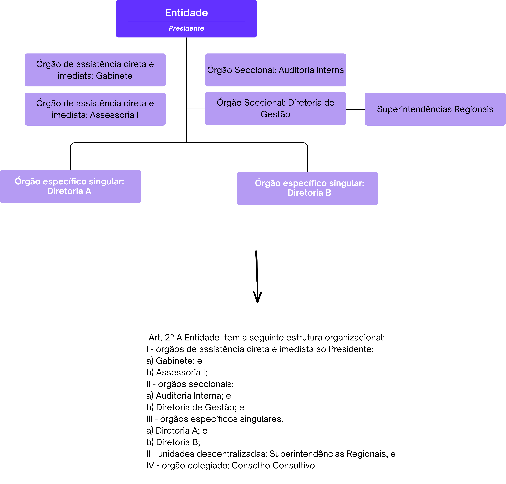

Alteração de estrutura regimental de autarquias e de estatuto de fundações públicas (Anexo I)
=============================================================================================
 
Conhecimentos básicos: unidades e competências obrigatórias
-----------------------------------------------------------
 
A natureza e a finalidade, a sede e as competências de uma entidade da
administração indireta são definidas pela respectiva lei de criação e devem ser
reproduzidas no Capítulo I do Anexo I do decreto.
 
Propostas de alteração de estrutura devem observar, inicialmente, quanto à lei
instituidora:
 
* o local da sede;
 
* as competências legais da entidade, que devem nortear as competências de todas
  as outras unidades subordinadas;
 
* a vinculação ministerial, se não houver lei posterior; e
 
* as unidades obrigatórias e regramentos específicos a serem observados no
  desenho da estrutura organizacional, inclusive quanto ao limite de Diretorias
  e à forma e composição da direção.
 
O `Decreto nº 10.829, de 5 de outubro de 2021 <decreto-10829_>`_ determina a
necessidade de descrição das competências da entidade e de suas diretorias, ou
equivalentes.
 
.. warning::
 
   Quando as unidades estiverem subordinadas diretamente à autoridade máxima da
   entidade, entende-se que são equivalentes às Diretorias, independentemente de
   seu nível, cabendo também a discriminação de suas competências. São exemplos
   de unidades dessa natureza o Gabinete e as Assessorias que não compõem o
   Gabinete do Presidente, assim como:
 
   * órgãos seccionais, como a Procuradoria Federal, a Auditoria Interna, a
     Ouvidoria e a Corregedoria; e
 
   * órgãos colegiados, como Conselho Diretor, Conselho Consultivo e Conselho
     Deliberativo.
   
   Para saber mais sobre níveis de cargos e funções e sua relação com a estrutura organizacional, consulte :ref:`hierarquia`.

Assim, se a proposta cria ou extingue alguma unidade com essas características,
será necessário inserir ou excluir suas competências no anexo específico do
decreto que aprova sua estrutura.
 
.. warning::
 
   A não ser que haja previsão legal, fique atento para que a proposta não traga
   alterações que gerem sombreamento de competências com órgãos ou outras entidades.
 
 
Organização básica e elementos da estrutura regimental ou estatuto
------------------------------------------------------------------
 
A organização do Anexo I segue os princípios definidos pelo
`Decreto nº 12.002, de 22 de abril de 2024 <decreto-12002_>`_, que estabelece as
normas gerais para elaboração, redação, alteração e consolidação de atos
normativos. Todos esses princípios devem ser observados também em propostas de
alteração de estruturas regimentais.
 
.. note::
 
   O `Decreto nº 12.002, de 22 de abril de 2024 <decreto-12002_>`_ permite
   compreender como estruturar um ato normativo, o que deve ser observado em sua
   redação para manter a clareza, precisão e ordem lógica, a formatação (como
   espaçamentos, uso de negritos e itálicos) e as regras para alterações e
   revogações.

 
No caso das estruturas organizacionais das entidades, a divisão do texto que trata
da estrutura regimental (autarquias) ou estatuto (fundação pública) segue, de forma
geral, a seguinte lógica, com pequenas variações:
 
Capítulo I — Da natureza e da finalidade
~~~~~~~~~~~~~~~~~~~~~~~~~~~~~~~~~~~~~~~~~
 
Por padrão, abrange o art. 1º, que informa a denominação e a sigla da entidade,
sua lei de criação, sua natureza jurídica, o órgão ao qual se vincula e sua sede,
sem ordem específica.
 
No Capítulo I devem constar, ainda, as finalidades ou competências da entidade,
espelhando, tanto quanto possível, sua lei de criação ou autorização.
 
.. admonition:: Exemplo — estrutura básica
 
   "Art. 1º  O/A [nome da entidade], [natureza jurídica: autarquia ou fundação
   pública], criada pela Lei nº [número e data de publicação], tem sede em
   [município e estado].
 
   Parágrafo único.  O/A [nome da entidade] tem como finalidade:
 
   [finalidades idênticas às constantes na lei de criação]
 
   Art. 2º  Ao/À [sigla da entidade] compete:
 
   [competências idênticas às constantes na lei de criação, se houver]"
 
.. warning::
 
   Embora não haja exigência de rigidez formal na redação — contanto que preserve
   o conteúdo —, diferenças entre as competências previstas no decreto que aprova
   a estrutura e àquelas descritas na lei são possíveis somente em casos
   excepcionais, como quando a entidade recebe uma nova competência legal ou
   quando realiza ajustes redacionais que não alterem o seu conteúdo.
 
.. admonition:: Exemplo — `INCRA (Decreto nº 11.232, de 10 de outubro de 2022) <decreto-11232_>`_
 
   "Art. 1º  O Instituto Nacional de Colonização e Reforma Agrária – INCRA,
   autarquia criada pelo Decreto-Lei nº 1.110, de 9 de julho de 1970, vinculada
   ao Ministério do Desenvolvimento Agrário e Agricultura Familiar, tem sede em
   Brasília, Distrito Federal, e atuação no território nacional.
 
   Parágrafo único.  O INCRA tem suas competências estabelecidas na legislação
   agrária, em especial as que se referem à:
 
   I - realização do ordenamento territorial;
 
   II - regularização da estrutura fundiária;
 
   III - promoção e execução da reforma agrária e da colonização; e
 
   IV - regularização fundiária das comunidades e dos territórios quilombolas."
 
.. admonition:: Exemplo — `FUNARTE (Decreto nº 12.586, de 12 de agosto de 2025) <decreto-12586_>`_
 
   "Art. 1º  A Fundação Nacional de Artes – Funarte, fundação pública, constituída
   com base na Lei nº 8.029, de 12 de abril de 1990, vinculada ao Ministério da
   Cultura, tem sede e foro em Brasília, Distrito Federal, e prazo de duração
   indeterminado.
 
   Parágrafo único.  A Funarte poderá manter, provisoriamente, sede e foro no
   Município do Rio de Janeiro, Estado do Rio de Janeiro, até ser determinada, nos
   termos de ato do Poder Executivo federal, a transferência para Brasília.
 
   Art. 2º  A Funarte tem como finalidade promover, incentivar e amparar, em todo
   o território nacional, a prática, o desenvolvimento, o fomento e a difusão das
   artes."
 
.. admonition:: Exemplo — `FUNASA (Decreto nº 11.223, de 5 de outubro de 2022) <decreto-11223_>`_
 
   "Art. 1º  A Fundação Nacional de Saúde - Funasa, fundação pública vinculada ao
   Ministério da Saúde, instituída com fundamento no disposto no art. 14 da Lei
   nº 8.029, de 12 de abril de 1990, tem sede e foro em Brasília, Distrito
   Federal, e prazo de duração indeterminado.
 
   Art. 2º  À Funasa, entidade de promoção e proteção à saúde, compete:
 
   I - fomentar soluções de saneamento para prevenção e controle de doenças; e
 
   II - formular e implementar ações de promoção e proteção à saúde relacionadas
   com as ações estabelecidas pelo Subsistema Nacional de Vigilância em Saúde
   Ambiental."
 
.. admonition:: Exemplo — `ENAP (Decreto nº 10.369, de 22 de maio de 2020) <decreto-10369_>`_
 
   "Art. 1º  A Fundação Escola Nacional de Administração Pública – Enap,
   instituída na forma prevista na Lei nº 6.871, de 3 de dezembro de 1980, e com
   denominação estabelecida pela Lei nº 8.140, de 28 de dezembro de 1990, com
   sede e foro no Distrito Federal, pessoa jurídica de direito público, vinculada
   ao Ministério da Gestão e da Inovação em Serviços Públicos, tem por finalidade
   promover, elaborar e executar programas de capacitação de recursos humanos para
   a administração pública federal, com vistas ao desenvolvimento e à aplicação de
   tecnologias de gestão que aumentem a eficácia e a qualidade permanente dos
   serviços prestados pelo Estado aos cidadãos.
 
   § 1º  Cabe ainda à Enap executar as seguintes atividades:
 
   I - coordenar, elaborar e executar os programas de desenvolvimento de pessoal
   civil do Poder Executivo federal, com vistas à inovação e à modernização do
   Estado, de forma a aumentar a eficácia e a qualidade dos serviços prestados
   aos cidadãos; (...)"
 
Capítulo II — Da estrutura organizacional
~~~~~~~~~~~~~~~~~~~~~~~~~~~~~~~~~~~~~~~~~~
 
Por padrão, abrange somente um artigo, que traz a organização interna da entidade
(uma descrição de seu organograma básico), dividida, geralmente, da seguinte forma:
 
* **I —** órgãos de assistência direta e imediata à autoridade máxima da entidade:
  engloba todas as unidades de assessoria direta, começando pelo Gabinete da
  autoridade máxima e seguindo com suas Assessorias (vide :ref:`assistencia-entidade`).
 
* **II —** órgãos seccionais: unidades que atuam como suporte administrativo
  setorial. São exemplos de órgãos seccionais a Ouvidoria, a Corregedoria, a
  Auditoria Interna, a Procuradoria Federal e a Diretoria responsável pelas
  atividades de planejamento, administração, gestão, finanças, logística,
  governança, inovação e tecnologia da informação.
 
* **III —** órgãos específicos singulares: engloba as unidades finalísticas do
  órgão, ou seja, as Diretorias e Departamentos.
 
* **IV —** unidades descentralizadas (se houver): engloba todas as unidades
  situadas em município distinto ao da sede do órgão.
 
* **V —** órgãos colegiados (se houver): engloba colegiados criados por lei, sob
  responsabilidade do órgão.
 
Exemplo simplificado:
 
.. _organograma-entidade:

 
   Orgonograma e o correspondente texto no Anexo I do decreto
 
.. warning::
 
   A ordem definida nesse artigo determinará a ordem das competências descritas no
   Capítulo IV e do Quadro demonstrativo de cargos e funções (Anexo II). A regra
   é: se a unidade está elencada no art. 2º, ela deve ter suas competências
   descritas e sua estrutura de cargos e funções definida. A exceção é válida para
   órgãos colegiados quanto ao quadro demonstrativo (já que não são unidades
   administrativas).
 
Capítulo III — Da direção e da nomeação
~~~~~~~~~~~~~~~~~~~~~~~~~~~~~~~~~~~~~~~~~
 
Esse capítulo descreve as especificidades da estrutura diretiva da entidade, em
alinhamento com a lei de criação: se é exercida pelo presidente ou por colegiado;
como se dá a indicação e a nomeação da autoridade máxima e de seus principais
cargos e funções de chefia (Procurador-Chefe, Auditor-Chefe, Corregedor, dentre
outros); e outras singularidades alinhadas à temática.
 
.. admonition:: Em desenvolvimento
 
   O conteúdo desta seção será desenvolvido em versão posterior deste manual.
 
Capítulo IV — Das competências dos órgãos
~~~~~~~~~~~~~~~~~~~~~~~~~~~~~~~~~~~~~~~~~~
 
Esse capítulo descreve as competências de todas as unidades organizacionais
elencadas no art. 2º, na exata ordem em que lá aparecem. Para cada grupo de
unidades, haverá uma Seção específica. Para cada unidade organizacional, haverá
um artigo.
 
.. note::
 
   A redação de competências segue regras e boas práticas gerais definidas no
   `Decreto nº 12.002, de 22 de abril de 2024 <decreto-12002_>`_.
 
   Todas as unidades setoriais têm suas atribuições gerais estabelecidas por normas
   específicas e, em alguns casos, a redação de suas competências foi padronizada
   pelo órgão central do sistema.
 
O Gabinete da autoridade máxima constitui-se como unidade obrigatória das
entidades, de forma que o Capítulo IV começa por ele:
 
.. admonition:: Exemplo — abertura do Capítulo IV
 
   "**Seção I**
 
   **Dos órgãos de assistência direta e imediata ao [nome do cargo da autoridade
   máxima]**
 
   Art. 3º  Ao Gabinete compete:
 
   I - xxx"
 
.. hint::
 
   Alterações pontuais de competências de unidades existentes serão feitas na forma
   de substituição do texto vigente. Por exemplo:
 
   "Art. 3º  O Anexo I ao Decreto nº [número do decreto com a estrutura vigente,
   com data], passa a vigorar com as seguintes alterações:
 
   "Art. 12.  .....................................................................................
 
   II - supervisionar, no âmbito da [nome da autarquia ou fundação pública], as
   atividades de modernização administrativa;
   ......................................................" (NR)
 
   Alterações pontuais que visem à criação de nova unidade serão feitas na forma de
   inserção de artigo, na ordem definida pela nova organização prevista no art. 2º.
 
   No exemplo de criação de nova unidade denominada Diretoria de Gestão
   Administrativa, como novo órgão seccional, altera-se o art. 2º e inclui-se
   suas competências na ordem estabelecida:
 
   "Art. 3º  O Anexo I ao Decreto nº [número do decreto com a estrutura vigente,
   com data], passa a vigorar com as seguintes alterações:
 
   "Art. 2º  ....................................................................
 
   II - .......................................................................
 
   e) Diretoria de Gestão Administrativa;
 
   ..........................................................................." (NR)
 
   "Art. 12-A  À Diretoria de Gestão Administrativa compete:
 
   I - assistir o Presidente na definição de diretrizes, na supervisão e na
   coordenação das atividades das Diretorias integrantes da estrutura da
   [nome da autarquia ou fundação pública]; e
 
   II - supervisionar, no âmbito da [nome da autarquia ou fundação pública],
   as atividades de modernização administrativa."
 
   Nesse segundo exemplo, o quadro demonstrativo de cargos e funções (Anexo II)
   também é substituído, com a inclusão de novo bloco de cargos e funções.
 
   .. TODO: inserir referência cruzada à seção sobre o Anexo II
 
Capítulo V — Das atribuições dos dirigentes
~~~~~~~~~~~~~~~~~~~~~~~~~~~~~~~~~~~~~~~~~~~~
 
Esse capítulo descreve as competências da autoridade máxima da entidade e dos
cargos de chefia de todas as unidades organizacionais elencadas no Capítulo II,
na exata ordem em que lá aparecem.
 
Adota-se seções específicas, com um artigo cada, para tratar, separada e
respectivamente, das competências da autoridade máxima, do Diretor-Executivo ou
equivalente e dos demais dirigentes.
 
.. admonition:: Exemplo — estrutura do Capítulo V
 
   "**CAPÍTULO V**
 
   **DAS ATRIBUIÇÕES DOS DIRIGENTES**
 
   **Seção I**
 
   **Do Presidente da [nome da entidade por extenso]**
 
   Art. X.  Ao Presidente da [nome da entidade por extenso] incumbe:
 
   I - xxx;
 
   II - xxx; e
 
   III - xxx.
 
 
   **Seção II**
 
   **Do Diretor-Executivo [ou equivalente]**
 
   Art. X.  Ao Diretor-Executivo incumbe:
 
   I - xxx;
 
   II - xxx; e
 
   III - xxx.
 
   **Seção III**
 
   **Dos demais dirigentes**
 
   Art. X.  Aos Diretores, ao Procurador-Chefe, ao Auditor-Chefe, ao Corregedor,
   ao Ouvidor, ao Chefe de Gabinete e aos demais dirigentes incumbe planejar,
   dirigir, coordenar e orientar a execução das atividades de suas unidades e
   exercer outras atribuições que lhes sejam cometidas pelo Presidente da
   [nome da entidade]."
 
.. note::
 
   A organização do Anexo I nos capítulos acima descritos corresponde a uma
   configuração mínima necessária à estruturação organizacional, e não impede a
   inclusão de outros capítulos específicos à organização da entidade. A existência
   de um órgão diretor, por exemplo, pode ensejar a inclusão de capítulo que trate
   "Da Diretoria Colegiada".
 
 
.. ---------------------------------------------------------------------------
.. Referências externas — legislação
.. ---------------------------------------------------------------------------
 
.. _decreto-10829: https://www.planalto.gov.br/ccivil_03/_ato2019-2022/2021/decreto/D10829.htm
.. _decreto-12002: https://www.planalto.gov.br/ccivil_03/_ato2023-2026/2024/decreto/D12002.htm
.. _decreto-11232: https://www.planalto.gov.br/ccivil_03/_ato2019-2022/2022/decreto/D11232.htm
.. _decreto-12586: https://www.planalto.gov.br/ccivil_03/_ato2023-2026/2025/decreto/D12586.htm
.. _decreto-11223: https://www.planalto.gov.br/ccivil_03/_ato2019-2022/2022/decreto/D11223.htm
.. _decreto-10369: https://www.planalto.gov.br/ccivil_03/_ato2019-2022/2020/decreto/D10369.htm
