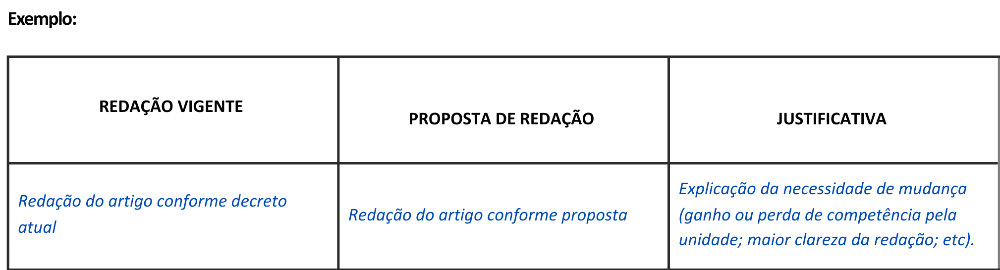

Como elaborar um parecer de mérito
===================================
 
O Parecer de Mérito é o documento que consolida as motivações técnicas para a
proposta de alteração de uma estrutura organizacional. Embora não exista um padrão
definido para o parecer de mérito, é relevante que ele inclua, ao menos, as
seguintes informações:
 
Justificativa Geral
~~~~~~~~~~~~~~~~~~~
 
Conforme o `Decreto nº 9.739, de 28 de março de 2019 <decreto-9739_>`_, a
justificativa deve abranger, no mínimo:
 
* a justificativa da proposta, caracterizada a necessidade de fortalecimento;
 
* a identificação sucinta dos macroprocessos, dos produtos e dos serviços
  prestados pelos órgãos e pelas entidades; e
 
* os resultados a serem alcançados com o fortalecimento institucional.
 
.. TODO: inserir referência ao artigo específico do Decreto nº 9.739/2019
 
Além disso, em atendimento ao
`Decreto nº 12.002, de 22 de abril de 2024 <decreto-12002_>`_, deve informar:
 
* a análise do problema que o ato normativo visa solucionar;
 
* os objetivos que se pretende alcançar;
 
* a identificação dos atingidos pelo ato normativo; e
 
* se aplicável, a análise do impacto sobre:
 
  * o meio ambiente; e
 
  * outras políticas públicas, inclusive quanto à interação ou à sobreposição.
 
.. TODO: inserir referência ao artigo específico do Decreto nº 12.002/2024
 
Justificativas específicas para as alterações de competências
~~~~~~~~~~~~~~~~~~~~~~~~~~~~~~~~~~~~~~~~~~~~~~~~~~~~~~~~~~~~~
 
Uma vez que todas as alterações de competências devem ser justificadas,
recomenda-se a inserção de quadro comparativo que facilite a identificação das
alterações e, assim, possibilite uma visualização completa pelo demandante e uma
análise mais ágil por parte do órgão central.
 
.. _quadro-justificativas:

 
   Quadro de justificativas de alterações de competências.
 
Justificativas específicas para as alterações na estrutura de cargos e funções
~~~~~~~~~~~~~~~~~~~~~~~~~~~~~~~~~~~~~~~~~~~~~~~~~~~~~~~~~~~~~~~~~~~~~~~~~~~~~~~
 
É relevante justificar as alterações de maior impacto na estrutura de cargos e
funções, especialmente quando se tratar de:
 
* inserções, edições ou exclusões de cargos e funções de nível 15 ou superior;
 
* aumento de níveis de cargos ou funções existentes;
 
* exclusão de cargos e funções de chefia de unidades de assistência direta e
  imediata ao titular do órgão ou entidade;
 
* criação de Secretarias com menos de duas Diretorias ou dois Diretores de
  Programa; e
 
* criação de Diretorias com menos de duas Coordenações-Gerais ou dois Gerentes
  de Projeto.
 
.. TODO: verificar se "Gerentes de Projeto" é a nomenclatura CCE/FCE vigente
 
Impacto orçamentário da proposta
~~~~~~~~~~~~~~~~~~~~~~~~~~~~~~~~~
 
O impacto orçamentário da proposta deve estar explicitado no parecer de mérito,
de forma a demonstrar os custos da nova estrutura para o exercício corrente (a
partir da vigência pretendida) e para os dois exercícios subsequentes.
 
.. TODO: inserir referência ou link explicativo sobre como calcular a data de
   vigência pretendida
 
.. admonition:: Ferramenta útil
 
   A partir das orientações da Secretaria de Orçamento Federal (SOF), a Diretoria
   de Modelos Organizacionais, da Seges, desenvolveu uma planilha que informa
   automaticamente o impacto orçamentário da proposta, a partir do quadro
   demonstrativo dos cargos e funções.
 
   O cálculo considera as remunerações mensais de cada cargo ou função adicionado
   à estrutura ou transformado, incluindo valores referentes à contribuição
   previdenciária pela União, décimo-terceiro salário e gratificação natalina.
 
   .. TODO: inserir link para download da planilha com passo a passo de uso
 
.. warning::
 
   Os padrões adotados nos órgãos e entidades do Poder Executivo federal facilitam
   a compreensão das estruturas pelos cidadãos e por outros agentes públicos, além
   de oferecer parâmetros importantes às análises pelo órgão central.
 
   Por esses motivos, alterações que fogem aos padrões e às recomendações deste
   manual ensejam uma análise mais detalhada do caso pelo órgão central, sendo
   necessário que a justificativa demonstre claramente as razões que motivam a
   excepcionalidade.
 
 
.. ---------------------------------------------------------------------------
.. Referências externas — legislação
.. ---------------------------------------------------------------------------
 
.. _decreto-9739: https://www.planalto.gov.br/ccivil_03/_ato2019-2022/2019/decreto/D9739.htm
.. _decreto-12002: https://www.planalto.gov.br/ccivil_03/_ato2023-2026/2024/decreto/D12002.htm