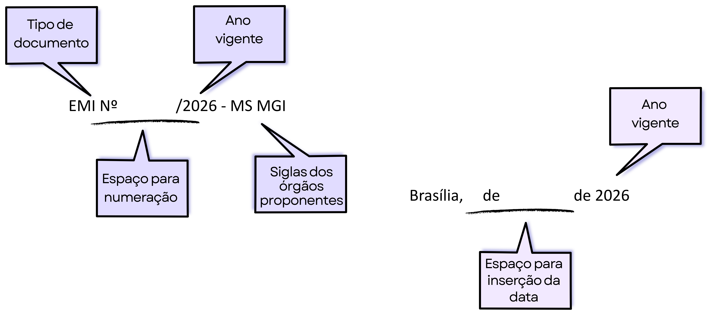

Como elaborar uma minuta de Exposição de Motivos Interministerial
=================================================================

Uma minuta de Exposição de Motivos Interministerial é um instrumento formal em que dois ou mais ministérios submetem conjuntamente ao Presidente da República um ato normativo (projeto de lei, decreto, medida provisória, entre outros), explicando de forma sintética e argumentada a necessidade e o mérito da medida. Trata-se, portanto, de instrumento imprescindível à instrução de proposta de aprovação ou alteração de estrutura organizacional de órgão ou entidade da Administração Pública federal.

.. note::

      Quando submetida por um único Ministério de Estado ao Presidente da República (ou Vice‑Presidente), para informar‑lhe sobre um assunto, propor uma medida ou submeter um projeto de ato normativo, denomina-se, tão somente, minuta de **Exposição de Motivos**.

Não há um modelo pré‑definido obrigatório, mas o documento deve observar as regras de redação oficial estabelecidas no Manual de Redação da Presidência da República. Por padrão, estrutura‑se da seguinte maneira:

      **Cabeçalho**: composto, sequencialmente, por: indicação do tipo de documento (EMI), com espaço para inserção do número do ato (a ser incluído no momento de sua publicação), acrescido do ano de referência e das siglas dos órgãos ministeriais proponentes.

      **Data**: alinhada à direita, com indicação do local (cidade), por extenso, seguida de espaço para inclusão do mês (por extenso) e dia da publicação e, por fim, do ano de referência.

.. _emi-cabecalho-data:

 
   Cabeçalho e data na EMI.

      Destinatário — utiliza-se o vocativo "Senhor Presidente da República", dado que o Manual de Redação da Presidência da República orienta, em diversos pontos, que se evite linguagem excessivamente solene, rebuscada ou personalista, em favor de um tratamento padronizado, impessoal e objetivo.

      .. note::

            Nesse sentido, recomenda-se, ainda, que não constem no corpo do texto de uma minuta de EMI expressões como "Vossa Excelência" e "Excelentíssimo Senhor Presidente da República", a fim de favorecer formas mais simples e funcionais de tratamento, mantendo o respeito institucional sem excesso de formalismo.

      **Corpo da minuta**: Sugere‑se organizar o texto em itens curtos, com parágrafos breves, objetivos e numerados. Além disso, deve-se utilizar linguagem formal, impessoal e objetiva, em 3ª pessoa, evitando viés ideológico e detalhamento técnico excessivo.

            1º) Apresentação da proposta – no parágrafo inicial, deve‑se indicar claramente o objeto da minuta que se pretende editar (por exemplo, decreto de aprovação ou alteração de estrutura organizacional). Quando couber, deve‑se mencionar o ato normativo atual que será alterado, suprimido ou mantido como referência.

            2º) Indicação do objetivo da medida - explique o que o ato normativo proposto pretende fazer (o que cria, altera, extingue ou reorganiza) de maneira objetiva e concisa, reservando o detalhamento normativo para os demais documentos que acompanham a respectiva EMI (como Parecer de Mérito, Parecer Jurídico e demais subsídios técnicos).

            3º) Indicação do impacto organizacional e da necessidade e conveniência da medida – deve-se descrever, de forma sintética, as vantagens qualitativas da proposta, tais como melhorias em eficiência, transparência, segurança jurídica, direitos e governança, bem como o seu alinhamento às políticas de governo, planos setoriais ou metas estratégicas, destacando, sucintamente, se pertinente, os impactos sociais, regulatórios, ambientais ou, ainda, os efeitos decorrentes da inércia na manutenção da situação atual.

            4º) Indicação dos custos da medida – deve-se apresentar, de forma sintética, o impacto esperado sob o viés orçamentário e indicar os instrumentos necessários à implementação da proposta, tais como remanejamento e transformação de cargos e funções, quando for o caso.

            5º) Trecho final da proposta – corresponde ao último parágrafo do corpo da minuta de EMI, em que se formaliza a submissão da proposta ao Presidente da República. Costuma seguir um padrão textual objetivo e repetitivo, sendo breve e sem a inclusão de novos argumentos.

                  .. admonition:: Exemplo

                        "6. São essas, Senhor Presidente, as razões que nos levam a submeter a sua consideração a presente proposta de decreto."

      **Fecho**: Deve-se utilizar o termo "Respeitosamente", imediatamente antes da assinatura dos ministros, como forma de encerrar o expediente com tom formal e devido respeito institucional, dado tratar-se de ato direcionado ao Presidente da República.

.. _corpo-minuta-emi:

   Estruturação do corpo de uma minuta de EMI

**Assinatura dos ministros proponentes**: Todos os ministros envolvidos assinam o documento, na qualidade de "Ministro de Estado" da respectiva Pasta, independente de um deles ser o "Ministro‑Autor" e o outro "Ministro‑Coautor". O bloco de assinaturas deverá estar alinhado ao centro, com o nome completo de cada Ministro (em caixa alta e negrito), seguido, logo abaixo, da descrição completa do respectivo cargo (ex.: "Ministro de Estado da [Área]").

