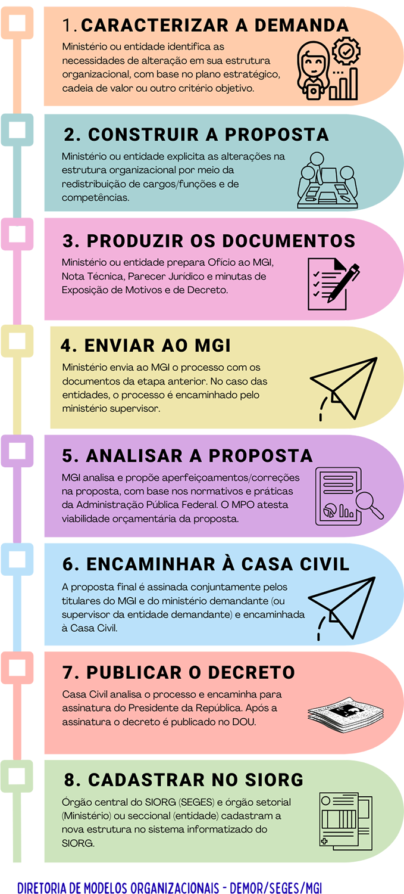

Como alterar uma estrutura regimental - passo a passo
=====================================================

.. admonition:: Sobre este capítulo

      O objetivo desse capítulo é fornecer um guia prático para a elaboração de todas as peças técnicas necessárias à instrução processual para uma alteração de estrutura regimental ou estatuto. 

      Se é sua primeira vez fazendo esse trabalho, recomendamos a leitura completa do capítulo.  

      Se você já tem experiência no assunto, mas tem dúvidas específicas, esses são os temas principais dessa parte do manual:
            - Qual é o fluxo ordinário de um processo de reestruturação;
            - Como definir o tipo de decreto adequado ao meu caso;
            - Como alterar uma estrutura regimental para um órgão da administração direta;
            - Como alterar uma estrutura regimental ou estatuto para uma autarquia ou fundação pública;
            - Como elaborar uma nota técnica ou parecer de mérito;
            - Como elaborar uma minuta de exposição de motivos interministerial.

Fluxo de uma reestruturação organizacional
-------------------------------------------

Na :numref:`fluxo-reestruturacao-label` você encontra o fluxo normal de uma reestruturação organizacional de ministério ou entidade.

.. _fluxo-reestruturacao-label:

   Fluxo de uma reestruturação organizacional

Peças que compõem um processo de reestruturação organizacional
---------------------------------------------------------------

Como falamos aqui, órgãos e entidades do Poder executivo federal são criados por lei e têm suas estruturas regimentais e estatutos aprovados por decreto presidencial. Alterações desses instrumentos exigem, portanto, a edição de um novo decreto presidencial e devem seguir um rito específico, iniciado a partir da elaboração e submissão da proposta ao órgão central do Siorg.

As peças que instruem essa proposta são elaboradas pelo órgão ou entidade interessada, estabelecidas pelo art. 5º do Decreto nº 9.739, de 28 de março de 2019 (link): 

    a) minuta de exposição de motivos interministerial; 

    b) minuta de decreto e seus anexos; 

    c) nota técnica da área competente; e 

    d) parecer jurídico. 

Se a proposta visar a reestruturação de um órgão da Presidência da República ou Ministério, a autoridade máxima encaminhará esses documentos, via Ofício, ao Ministério da Gestão e da Inovação em Serviços Públicos (MGI).  

Se a proposta visar a reestruturação de uma autarquia ou fundação pública, a autoridade máxima da entidade encaminhará o ofício ao Ministério supervisor e este complementará a proposta com um parecer jurídico e uma nota técnica próprios. A documentação completa será submetida ao MGI, via ofício assinado pelo Ministro. 

Tipos de decreto para reestruturação organizacional de órgãos ou entidades 
--------------------------------------------------------------------------
 
Independentemente se órgão, autarquia ou fundação pública, a peça que materializará as alterações necessárias à estrutura organizacional é a minuta de decreto.  

A forma de organização dessa peça deve ser definida após um estudo interno sobre as alterações que serão necessárias na estrutura organizacional vigente (link para o site com as estruturas vigentes?), sempre considerando o alcance dos objetivos institucionais e a entrega de serviços públicos. Feita essa reflexão e o mapeamento das alterações que serão necessárias, a definição do tipo de decreto mais adequado dependerá do tipo de alteração almejada: 

1) **Alterações numerosas e significativas**, que demandam reestruturação completa da estrutura regimental ou estatuto.
      **Indicação**: edição de decreto que aprova uma nova estrutura regimental ou estatuto. Falamos, aqui, numa substituição da norma existente, que será revogada. Assim, segue-se, de forma geral, a mesma organização do decreto vigente.
    
      **Organização sequencial padrão**: Epígrafe, ementa, preâmbulo (link para o Decreto n. 12.002, de 22 de abril de 2024) e texto principal contendo, resumidamente, os remanejamentos necessários à nova estrutura, regramentos específicos, revogação do decreto que trata da estrutura atual e, se for o caso, de outros que a alteraram, e data de vigência da nova estrutura (download de modelo);
       **Anexo I**: traz a descrição de toda estrutura regimental ou estatuto, com as competências e atribuições de suas unidades (link);

       **Anexo II**: contendo:

            a) o quadro demonstrativo dos cargos em comissão e das funções de confiança (link); e

            b) o quadro resumo de custos (link) dos cargos em comissão e das funções de confiança (link).
       **Anexo III**: contendo quadros com os remanejamentos já descritos no texto principal, com custo unitário e total (link); e

       **Anexo IV**: com quadro demonstrativo dos cargos comissionados executivos – CCE e das funções comissionadas executivas - FCE, contendo as transformações de cargos e funções que serão necessárias à estrutura proposta. Esse anexo nem sempre é necessário e depende de alguns fatores, que você pode ler aqui (link).

            .. warning::

                  A Diretoria de Modelos Organizacionais, da Seges, desenvolveu uma planilha que constrói automaticamente os anexos II e III, a partir do quadro demonstrativo dos cargos e funções. Essa mesma planilha informa também se a alteração implicará ou não impacto orçamentário.

                  (Download, com passo a passo sobre a planilha?)

2) **Alterações pontuais e simples**
      **Indicação**: decreto que altera a atual estrutura regimental ou estatuto. 

      **Organização sequencial padrão**: epígrafe, ementa, preâmbulo, com texto principal e anexos dependentes das alterações propostas. 

      a) **Se relacionadas somente à alteração de quantidade, categoria ou nível de cargos e funções, sem a criação ou extinção de unidades de diretoria ou secretaria, ou revisão de suas competências.**
            O texto principal trará os remanejamentos necessários, a referência ao anexo de transformação de cargos e funções (se houver), a revogação de algum ato ou dispositivo normativo (se houver) e a data de vigência da nova estrutura (download de modelo); 

            Anexo I: contendo quadros com os remanejamentos já descritos no texto principal, com custo unitário e total (link); e 

            Anexo II: com quadro demonstrativo dos cargos comissionados executivos – CCE e das funções comissionadas executivas - FCE, contendo as transformações de cargos e funções que serão necessárias à estrutura proposta. Esse anexo nem sempre é necessário e depende de alguns fatores, que você pode ler aqui. Em não sendo necessário, o Anexo III (abaixo) denomina-se Anexo II. 

            Anexo III: se houver necessidade de substituição dos quadros em vigor, contendo o quadro demonstrativo dos cargos em comissão e das funções de confiança (link) e o quadro resumo de custos dos cargos em comissão e das funções de confiança (link). 

            .. warning::

                  Algumas alterações na estrutura de cargos e funções podem ser realizadas por meio de Portaria Ministerial. Esse é o caso das permutas entre cargos e funções de mesmo nível e categoria, e das realocações de cargos e funções de nível 14 ou inferior. (complementar)

                  Essas alterações dispensam a edição de um decreto presidencial e seguem as regras estabelecidas nos art. 12 e 13 do Decreto n. 10.829/21 (link).

      b) **Se relacionadas somente à revisão das competências criação de unidades de diretoria ou secretaria, sem alteração de quantidade, categoria ou nível de cargos e funções.**
            O texto principal trará, resumidamente, as alterações propostas nas competências das unidades específicas, a revogação de algum ato ou dispositivo normativo (se houver) e a data de vigência da nova estrutura. Não há Anexos. (download de modelo);

      c) **Se relacionadas à alteração de quantidade, categoria ou nível de cargos e funções, com a criação de unidades de diretoria ou secretaria, ou revisão de suas competências.**
            O texto principal trará os remanejamentos necessários, a referência ao anexo e transformação de cargos e funções (se houver), as alterações propostas na estrutura básica e nas competências das unidades específicas, regramentos específicos (se houver), a revogação de algum ato ou dispositivo normativo (se houver) e a data de vigência da nova estrutura (download de modelo);

            Anexo I: contendo quadros com os remanejamentos já descritos no texto principal, com custo unitário e total (link); e

            Anexo II: com quadro demonstrativo dos cargos comissionados executivos – CCE e das funções comissionadas executivas - FCE, contendo as transformações de cargos e funções que serão necessárias à estrutura proposta. Esse anexo nem sempre é necessário e depende de alguns fatores, que você pode ler aqui. Em não sendo necessário, o Anexo III (abaixo) denomina-se Anexo II.

            Anexo III: se houver necessidade de substituição dos quadros em vigor, contendo o quadro demonstrativo dos cargos em comissão e das funções de confiança (link) e o quadro resumo de custos dos cargos em comissão e das funções de confiança (link).

            .. note::

               A divisão da norma em anexos é exclusivamente didática, sendo impossível dissociar as competências de uma unidade de sua estrutura de cargos e funções. Afinal, são a complexidade, a finalidade e a natureza da atuação de uma unidade que determinarão o desenho organizacional mais adequado para ela.

3) **Necessidades temporárias de cargos ou funções, para atendimento a necessidades emergenciais, transitórias ou estratégicas, por período certo e finalidade determinada.**
       **Indicação**: decreto que remaneja, em caráter temporário, cargo em comissão ou função de confiança do Órgão Central de Administração, responsável pela reserva técnica de cargos em comissão e funções de confiança, para órgão e entidades.

       **Organização sequencial padrão**: Epígrafe, ementa, preâmbulo. O texto principal deve incluir, necessariamente:
          - Os remanejamentos propostos;

          - A finalidade dos cargos e funções;

          - A data de restituição dos cargos e funções; e

          - Dispositivo que informa que os cargos as funções não integrarão a estrutura regimental do órgão ou entidade, e que os atos de nomeação ou designação relacionados terão seu caráter de transitoriedade expressos, mediante remissão ao caput do art. 1º.

      O texto principal abrange ainda: referência à transformação de cargos e funções (se houver), regramentos específicos (se houver), revogação de algum ato ou dispositivo normativo (se houver) e data de vigência (inserir modelo como exemplo).

      **Anexo**: se houver transformações, deverá refletir o quadro demonstrativo dos cargos comissionados executivos - CCE e das funções comissionadas executivas - FCE, transformados. Esse anexo nem sempre é necessário e depende de alguns fatores, que você pode ler aqui.

.. Tipodecreto-label:
.. figure:: ../_static/images/Fig1_tipos_de_decreto.png
   :alt: Tipos de decreto
   :align: center
   :name: Tipodecreto

Alteração de estruturas regimentais de órgãos da Presidência da República e dos Ministérios (Anexo I) 
-----------------------------------------------------------------------------------------------------

Conhecimentos básicos: unidades e competências obrigatórias
+++++++++++++++++++++++++++++++++++++++++++++++++++++++++++
As competências (link glossário) de cada órgão são dadas pela lei que organiza a Administração Pública federal, usualmente publicada no início do governo em exercício, na forma de medida provisória (vide Lei n. 14.600, de 19 de junho de 2023).

Propostas de alteração de estrutura devem, inicialmente, observar essa lei quanto:

      a. competências do órgão, que devem ser replicadas no art. 1º do anexo I do decreto que aprova sua estrutura regimental, e que devem nortear as competências de todas outras unidades subordinadas. Esse é o único artigo que compõe o Capítulo I: Da natureza e da competência.

      b. unidades obrigatórias e regramentos específicos a serem observados no desenho da estrutura organizacional, inclusive quanto ao limite de Secretarias em cada Ministério.

Atualmente, a Lei n. 14.600/23 (link para art. 50 da lei) determina que são obrigatórias as seguintes unidades (link em cada unidade?):
-     Gabinete do Ministro;
-     Secretaria-Executiva, exceto no Ministério da Defesa e no Ministério das Relações Exteriores;
-     Consultoria Jurídica;
-     Ouvidoria; 
-     Secretarias; e
-     "Órgão responsável pelas atividades de administração patrimonial, de material, de gestão de pessoas, de serviços gerais, de orçamento e finanças, de contabilidade e de tecnologia da informação, vinculado à Secretaria-Executiva".

Para essas e todas as demais unidades que compõem o órgão, deve-se observar a necessidade de definição das competências no decreto que trata da estrutura, determinada pelo Decreto n 10.829, de 2021: 
“Art. 5º  O decreto que aprovar a estrutura regimental ou o estatuto do órgão ou da entidade deverá discriminar, em anexo específico:
      I - as competências do órgão e de suas secretarias, ou equivalentes, quando se tratar da administração pública direta; e
      (...)
      § 1º  A discriminação de que trata o caput poderá ser estendida às demais unidades administrativas, até o limite de CCE ou FCE de nível 15, observadas as competências e as especificidades do órgão ou da entidade.”

Atualmente, convencionou-se descrever as competências de todas as unidades de nível 15 ou superior (nível de diretoria ou departamento).

Ainda, quando as unidades estiverem subordinadas diretamente ao Ministro, entende-se que são equivalentes às Secretarias, independentemente de seu nível, cabendo também a discriminação de suas competências. São exemplos de unidades dessa natureza a Ouvidoria, a Corregedoria e as Assessorias que não compõem o Gabinete do Ministro. Aqui, é possível consultar os níveis a serem associados a cada unidade.

Assim, se sua proposta cria ou extingue alguma unidade com essas características, será necessário inserir ou excluir suas competências. 

.. warning::

                  A não ser que haja previsão legal, fique atento para que sua proposta não traga alterações que gerem sombreamento de competências com outros órgãos.

Organização básica e elementos da estrutura regimental
++++++++++++++++++++++++++++++++++++++++++++++++++++++
A organização do Anexo I segue os princípios definidos pelo Decreto n. 12.002, de 22 de abril de 2024, onde constam as normas gerais para elaboração, redação, alteração e consolidação de atos normativos. Todos esses princípios devem ser observados também em propostas de alteração de estruturas regimentais.

.. note::

   O Decreto n. 12.002, de 22 de abril de 2024 permite compreender como estruturar um ato normativo, o que deve ser observado em sua redação para manter a clareza, precisão e ordem lógica, formatação (como espaçamentos, uso de negritos e itálicos), regras para alterações e para as revogações. (inserir links para as partes específicas da norma).

No caso das estruturas, a divisão do texto que trata da estrutura regimental segue a seguinte lógica:

.. admonition:: Capítulo I: DA NATUREZA E DA COMPETÊNCIA

      Por padrão, abrange somente o art. 1º, que traz as competências do órgão:
      
      “Art. 1º  O [nome do órgão], órgão da administração pública federal direta, tem como área de competência os seguintes assuntos: 
      
      [competências idênticas às constantes na lei que estabelece a organização básica dos órgãos da Presidência da República e dos Ministérios]“

.. admonition:: Capítulo II: DA ESTRUTURA ORGANIZACIONAL

      Por padrão, abrange somente o art. 2º, que traz a organização interna do órgão (uma descrição do organograma básico do órgão), dividida da seguinte forma:

      I - órgãos de assistência direta e imediata ao Ministro de Estado (link): engloba todas as unidades de assessoria direta (começando pelo Gabinete do Ministro e seguindo com suas Assessorias Especiais), unidades setoriais (Ouvidoria, Corregedoria, Consultoria Jurídica) e a Secretaria-Executiva, com suas Subsecretarias.
      
      II - órgãos específicos singulares: engloba as unidades finalísticas do órgão, ou seja, as Secretarias e suas Diretorias ou Departamentos.
      
      III – unidades descentralizadas (se houver): engloba todas as unidades situadas em município distinto ao da sede do órgão.
      
      IV – órgãos colegiados (se houver): engloba colegiados criados por lei, sob responsabilidade do órgão.
      
      V – entidades vinculadas (se houver): engloba autarquias, fundações públicas e empresas públicas vinculadas ao órgão.

Exemplo simplificado

.. Organograma-label:
.. figure:: ../_static/images/Fig2_Organograma_Ministerio.png
   :alt: Organograma
   :align: center
   :name: Organograma

.. admonition:: Capítulo III: DAS COMPETÊNCIAS DOS ÓRGÃOS

      Esse capítulo descreve as competências de todas as unidades organizacionais elencadas no art. 2º, na exata ordem que lá aparecem. Para cada grupo de unidades, haverá uma Seção específica. E para cada unidade organizacional, haverá um artigo.

.. note::

   A redação de competências segue regras e boas práticas gerais, definidas a partir no Decreto n. 12.002, de 22 de abril de 2024.

   Todas as unidades setoriais têm suas atribuições gerais estabelecidas por normas específicas e, em alguns casos, a redação de suas competências foi padronizada pelo órgão central do sistema.

Como o Gabinete do Ministro é uma unidade obrigatória em todos os órgãos com status ministerial, conforme lei que estabelece a organização básica dos órgãos da Presidência da República e dos Ministérios, começaremos o Capítulo III por ele.

Assim:

“**Seção I**

**Dos órgãos de assistência direta e imediata ao Ministro de Estado X**

Art. 3º  Ao Gabinete compete:

I - xxx”

.. hint::
   
      Alterações pontuais de competências de unidades existentes serão feitas na forma de substituição do texto vigente. Por exemplo:

            "Art. 3º  O Anexo I ao Decreto nº [número do decreto com a estrutura vigente, com data], passa a vigorar com as seguintes alterações:

            “Art. 12.  .....................................................................................
            
            II - supervisionar, no âmbito do Ministério, as atividades de modernização administrativa;
            ..........................................................................................................” (NR)

      Alterações pontuais que visem a criação de nova unidade serão feitas na forma de inserção de artigo, na ordem definida pela nova organização prevista no art. 2º.

      No exemplo de criação de nova unidade denominada Subsecretaria de Gestão Administrativa, subordinada à já existente Secretaria-Executiva, altera-se o art. 2º e inclui-se suas competências logo após as atualmente descritas para a Secretaria-Executiva (art. 12):

            "Art. 3º  O Anexo I ao Decreto nº [número do decreto com a estrutura vigente, com data], passa a vigorar com as seguintes alterações:

            “Art. 2º  .......................................

            I - ..............................................................

            j) Secretaria-Executiva: Subsecretaria de Gestão Administrativa;
            ...................................................................................” (NR)

            “Art. 12-A  À Subsecretaria de Gestão Administrativa compete:

            I - assistir o Ministro de Estado na definição de diretrizes, na supervisão e na coordenação das atividades das Secretarias integrantes da estrutura do Ministério; e

            II - supervisionar, no âmbito do Ministério, as atividades de modernização administrativa."

      Nesse segundo exemplo, o quadro demonstrativo de cargos e funções (Anexo II) também é substituído, com inclusão de novo bloco de cargos e funções (link).

.. admonition:: Capítulo IV: DAS ATRIBUIÇÕES DOS DIRIGENTES

      Esse capítulo define XXXX.

Alteração do quadro demonstrativo dos cargos em comissão e das funções comissionadas (Anexo II a)
-------------------------------------------------------------------------------------------------

O quadro demonstrativo de cargos é um resumo do organograma do órgão que foi descrito no art. 2º do Anexo I, representado por uma tabela. A fim de facilitar as consultas aos decretos vigentes, convencionou-se substituir esse quadro por inteiro sempre que sofre alterações.

Essa tabela é formada por quatro colunas e traz todos os cargos em comissão e as funções comissionadas de que o órgão dispõe, representados por códigos.

.. AnexoIIA-label:
.. figure:: ../_static/images/Fig3a_anexoiia.png
   :alt: AnexoIIA
   :align: center
   :name: Anexo II a

Cada cargo ou função tem um código que identifica o tipo, a categoria e o nível:

.. codigoccefce-label:
.. figure:: ../_static/images/Fig3_codigo.png
   :alt: Codigo_CCE_FCE
   :align: center
   :name: Código CCE FCE

E cada código possui uma ou mais denominações específicas, conforme a tabela XXX.

.. seealso::
   
   Para saber mais sobre os diferentes tipos, categorias e níveis, consulte o capítulo x.

Os cargos e funções existentes no órgão são agrupados conforme regras dispostas no Decreto nº 10.829, de 2021, que já orientou o desenho do Anexo I: se a unidade consta no art. 2º, há competência descrita e a unidade precisa ser nomeada no quadro demonstrativo. Essa unidade e os cargos e funções a ela subordinados compõem um grupo, no qual as unidades subordinadas recebem nomenclatura genérica e são apresentadas de forma agrupada.

.. QuadroCargos-label:
.. figure:: ../_static/images/Fig4_quadro_de_cargos.png
   :alt: QuadroCargos
   :align: center
   :name: Quadro de Cargos e Funções

Como se observa do exemplo acima, a organização do quadro demonstrativo respeita a seguinte ordem para cada grupo:

Primeira linha do grupo:

      Coluna 1: Nome da unidade específica em caixa alta (conforme art. 2º do Anexo I);

      Coluna 2: 1, uma vez que só é possível haver um chefe para a unidade;

      Coluna 3: Nome do cargo ou função da chefia da unidade (que não pode se repetir no mesmo grupo); e

      Coluna 4: código do cargo ou função do chefe da unidade, necessariamente de categoria 1 (direção), no maior nível do grupo

Segunda linha:

Cargo ou função da chefia adjunta, se o grupo for chefiado por um cargo ou função de nível 17 ou 18:

      Coluna 1: Vazio (já que um adjunto não chefia unidade);

      Coluna 2: quantidade de chefias adjuntas (usualmente limitada a 1);

      Coluna 3: Nome do cargo ou função da chefia da unidade seguido do termo “Adjunto”; e

      Coluna 4: Código do cargo ou função com o segundo maior nível do grupo, necessariamente de categoria 1 (direção).

.. note::

   O Adjunto é o único cargo ou função de categoria 1 que não chefia unidade. A todos os demais deve ser associada uma unidade sem nomenclatura específica.

Linhas seguintes:

Observam a ordem decrescente de nível. Dentro do mesmo nível, observa-se a ordem crescente da categoria. Se existe um cargo e uma função com a mesma categoria e o mesmo nível, o cargo (CCE) é posicionado antes da função (FCE).

Finalizada a descrição do grupo, pula-se uma linha da tabela e inicia-se o grupo com a próxima unidade descrita no art. art. 2º do Anexo I.

O que mais levar em consideração:

      1) O cargo do Ministro não consta no quadro;

      2) Os primeiros cargos e funções constantes na tabela serão os que assessoram diretamente o Ministro (categorias 2 ou 3);

      3) Os CCE ou as FCE de mesma denominação não podem ter relação de subordinação entre si;

      4) Todas as alterações realizadas por portaria ministerial devem ser consideradas no novo quadro demonstrativo (e no quadro resumo de custos), já que esse será o retrato mais recente da estrutura do órgão. Alterações não incorporadas – ainda que acidentalmente - exigirão, portanto, nova portaria ministerial de realocação ou permuta e, provavelmente, novos atos de nomeação ou designação;

      5) O custo da estrutura proposta deve sempre ser considerado no ato de sua construção. Propostas com impacto orçamentário dependem da disponibilidade de cargos e funções na reserva técnica e exigem articulação junto à Seges, podendo não ser acatadas em sua integralidade, ainda que cumpram requisitos legais e de boas práticas.

As demais tabelas que compõem o decreto que aprova a estrutura regimental seguem essas regras.

Conhecendo as unidades administrativas da administração direta e suas regras específicas
----------------------------------------------------------------------------------------
As regras a seguir focam na estruturação hierárquica das unidades, que são chefiadas por ocupantes de cargos e funções da categoria 1. No entanto, outros tipos de cargos e funções (categorias 2, 3 e 4), que não são visíveis no organograma do órgão, podem compor a estrutura de cada unidade. 

A regra básica para definir se um cargo ou função pode ser inserido em dada unidade é: se o nível for menor do que o atribuído ao titular, é possível alocá-lo na unidade. Aqui é possível saber mais sobre as nomenclaturas e atuação associadas a cada categoria.

Órgãos de assistência direta e imediata ao Ministro de Estado
+++++++++++++++++++++++++++++++++++++++++++++++++++++++++++++

**a) Gabinete do Ministro**

Unidade obrigatória: sim

Nomenclatura permite complemento: não

Sobre o titular: Chefe de Gabinete, ocupante de cargo ou função, necessariamente de código 1.15 ou 1.16 em Ministérios. Em órgãos da Presidência da República, foi convencionado o código 1.17.

Sobre as competências: necessariamente descritas em Decreto. 

Sugere-se, no mínimo:
Não há um padrão 

Ainda, dependem de sua estruturação (por exemplo: se exerce atividades de cerimonial). 
Devem contemplar, no mínimo...

**b) Assessoria Especial de Controle Interno**

Unidade obrigatória: não, mas é necessário que o órgão conte ao menos com um Assessor Especial responsável pela temática.

Nomenclatura permite complemento: não

Sobre o titular: Chefe de Assessoria Especial, necessariamente FCE 1.15.

Sobre as competências: necessariamente descritas em Decreto, definidas pelo art. 13 do Decreto nº 3.591, de 2000.

.. admonition:: Outras informações

   Apesar de apoiar o Sistema de Controle Interno do Poder Executivo Federal, instituído pelo Decreto nº 3.591, de 6 de setembro 2000, as Assessorias Especiais de Controle Interno não são órgãos setoriais desse Sistema, papel esse reservado às Secretarias de Controle Interno da Casa Civil, da Advocacia-Geral da União, do Ministério das Relações Exteriores e do Ministério da Defesa.

**c) Outras Assessorias e Assessorias Especiais**

Unidades obrigatórias: não

Nomenclatura permite complemento: sim, necessariamente.

Sobre o titular: Chefe de Assessoria, de código 1.13 ou 1.14, no caso da Assessoria; Chefe de Assessoria Especial, de código 1.15 ou 1.16, no caso da Assessoria Especial, independente da denominação complementar da unidade.

A escolha do nível da Assessoria depende da complexidade dos processos analisados e do número de servidores atuantes na unidade.

Sobre as competências: descritas em decreto se nível 15 ou 16 (Assessoria Especial), ou se não estiver subordinada a outra unidade (Assessoria).

Serão definidas a partir da temática específica, devendo sempre estar associadas à assistência direta ao Ministro, em assuntos de interesse do Ministério, que envolvam conhecimentos e articulações que ultrapassam aqueles das unidades finalísticas.

São Assessorias típicas:

      Assessoria de Participação Social e Diversidade

      Assessoria de Relações Internacionais

      Assessoria de Comunicação Social

      Assessoria Parlamentar

.. warning::

   O uso da denominação “Assessoria” para designar uma unidade é restrita àquela de assistência direta e imediata Ministro de Estado – a existência de assessores não implica a constituição de unidade administrativa desse tipo.

Órgãos setoriais
++++++++++++++++

São aquelas unidades que executam atividades comuns a todos os órgãos, sob coordenação de um órgão central, formando um sistema estruturador. 

      *Ouvidoria*

            Unidade obrigatória: sim

            Nomenclatura permite complemento: sim, em casos excepcionais, quando se tratar de Ouvidoria que contemple atividades que extrapolam a atuação do órgão (a exemplo da Ouvidoria-Geral do Sistema Único de Saúde e Ouvidoria Nacional dos Direitos Humanos).

            Sobre o titular: Ouvidor, CCE ou FCE, usualmente de código 1.13 ou 1.14, exceto quando responsável por atividades de alta complexidade e capilaridade.

            Sistema estruturador associado: Sistema de Ouvidoria do Poder Executivo federal, instituído pelo Decreto nº 9.492, de 5 de setembro de 2018.

            Órgão central do sistema: Controladoria-Geral da União, por meio da Ouvidoria-Geral da União.

            Sobre as competências: necessariamente descritas em Decreto, definidas pelo art. 10 do Decreto nº 9.492, de 2018.

            .. admonition:: Outras informações

                  A nomeação, a designação, a exoneração ou a dispensa dos titulares das unidades setoriais do Sistema de Ouvidoria do Poder Executivo federal será submetida, pelo dirigente máximo do órgão ou da entidade, à aprovação da Controladoria-Geral da União.

      *Corregedoria*

            Unidade obrigatória: não

            Nomenclatura permite complemento: não

            Sobre o titular: Corregedor, CCE ou FCE, usualmente de código 1.13 ou 1.14.

            Sistema estruturador associado: Sistema de Correição do Poder Executivo Federal, instituído pelo Decreto nº 5.480, de 30 de junho de 2005.

            Órgão central do sistema: Controladoria-Geral da União, por meio da Corregedoria-Geral da União.

            Sobre as competências: necessariamente descritas em Decreto, definidas pelo art. 5º do Decreto nº 5.480, de 2005.

            .. admonition:: Outras informações

                  A indicação dos titulares das unidades setoriais de correição será submetida previamente à apreciação do Órgão Central do Sistema de Correição.  Os critérios para nomeação ou designação são definidos pelo art. 8º do Decreto nº 5.480, de 2005.

      *Consultoria Jurídica*

            Unidade obrigatória: sim

            Nomenclatura permite complemento: não

            Sobre o titular: Consultor Jurídico, necessariamente FCE, usualmente de código 1.15. 

            Sobre as competências: necessariamente descritas em Decreto, definidas pelo art. 11 da Lei Complementar nº 73, de 10 de fevereiro de 1993.

            As Consultorias Jurídicas junto aos Ministérios são órgãos de execução da Consultoria-Geral da União (da Advocacia-Geral da União). Integram a estrutura organizacional dos respectivos Ministérios, sendo subordinadas administrativamente ao Ministro, mas nos aspectos técnico e jurídico, subordinam-se ao Consultor-Geral da União e ao Advogado-Geral da União.

Secretaria-Executiva
++++++++++++++++++++

      Unidade obrigatória: sim

      Nomenclatura permite complemento: não

      Sobre o titular: Secretário-Executivo, necessariamente de código CCE 1.18.

      Sistemas estruturadores usualmente associados:

            * Sistema de Planejamento e de Orçamento Federal,

            * Sistema de Administração Financeira Federal,

            * Sistema de Organização e Inovação Institucional - SIORG,

            * Sistema de Gestão de Documentos de Arquivo - SIGA,

            * Sistemas de Pessoal Civil da Administração Federal - SIPEC,

            * Sistema de Serviços Gerais - SISG

            * Sistema de Contabilidade Federal 

Sobre as competências: necessariamente descritas em Decreto.

Sugere-se:

      "*Compete à Secretaria-Executiva*:

      *I - assistir o Ministro de Estado na definição de diretrizes e na supervisão e coordenação das atividades das Secretarias integrantes da estrutura do Ministério [e de suas entidades vinculadas (quando houver)]; e*

      *II - orientar, no âmbito do Ministério, a execução das atividades de administração patrimonial e das atividades relacionadas aos sistemas federais de planejamento e de orçamento, de contabilidade, de administração financeira, de administração dos recursos de informação e informática, de recursos humanos, de organização e inovação institucional e de serviços gerais*.

      *Parágrafo único.  A Secretaria-Executiva exerce a função de órgão setorial dos Sistemas de Planejamento e de Orçamento Federal, de Administração Financeira Federal, de Organização e Inovação Institucional - SIORG, de Gestão de Documentos de Arquivo - SIGA, de Pessoal Civil da Administração Federal - SIPEC, de Serviços Gerais - SISG, de Contabilidade Federal e de Administração dos Recursos de Tecnologia da Informação - SISP*”.

Caso o órgão integre o Centro de Serviços Compartilhados Colaboragov, a Secretaria de Serviços Compartilhados, do Ministério da Gestão e da Inovação em Serviços Públicos, atua como órgão setorial desses sistemas, nos termos do Decreto nº 11.837, de 21 de dezembro de 2023. 

Regras específicas sobre a estrutura de cargos e funções que compõem a Secretaria-Executiva:

      1. Foi convencionado que todos os Secretários-Executivos contarão com um Secretário-Executivo Adjunto, CCE ou FCE, de código 1.17.

      2. A Secretaria-Executiva é usualmente estruturada em Subsecretarias (chefiadas por um Subsecretário, ocupante de CCE ou FCE, de código 1.15 ou 1.16), com competências e estrutura delimitadas em decreto. Aqueles órgãos que aderiram ao Centro de Serviços Compartilhados Colaboragov, costumam contar, em suas estruturas, com uma única unidade voltada à gestão das atividades dos sistemas estruturadores acima mencionados (uma Diretoria de Gestão e Administração ou uma Subsecretaria de Administração).

.. admonition:: Outras informações

   Cabe ao Secretário-Executivo exercer a função de substituto do Ministro de Estado, conforme disposto no Decreto nº 8.851, de 20 de setembro de 2016.

Órgãos específicos singulares
+++++++++++++++++++++++++++++

      *I - Secretarias*

      Unidade obrigatória: ao menos uma, no limite da quantidade eventualmente estabelecida na Lei que estabelece a organização básica dos órgãos da Presidência da República e dos Ministérios.

      Nomenclatura permite complemento: sim, necessariamente

      Sobre o titular: Secretário, CCE ou FCE, necessariamente de código 1.17. 

      Sobre as competências: necessariamente descritas em Decreto.

      As Secretarias devem ser organizadas de forma que o órgão seja capaz de exercer todas as competências definidas na Lei que estabelece a organização básica dos órgãos da Presidência da República e dos Ministérios. Por regra, uma Secretaria é responsável por uma ou mais das competências atribuídas ao órgão.

      Regras específicas sobre a estrutura de cargos e funções que compõem as Secretarias:

      1. As Secretarias usualmente contam com um Gabinete (chefiado por um Chefe de Gabinete, ocupante de CCE ou FCE de código 1.13 ou 1.14, sem competências ou estrutura discriminada em Decreto) e um Secretário-Adjunto, de código 1.15 ou 1.16.

      2. Às Secretarias se subordinam Diretorias ou Departamentos, responsáveis por executar as atividades, políticas e programas planejadas no âmbito da Secretaria.

      3. É possível estruturar uma ou mais unidades de nível 14 ou menor para atuação na assistência direta ao Secretário. No entanto, sugere-se cautela nessa medida, a fim de manter a racionalidade do desenho organizacional da unidade, evitando sobreposição à atuação dos Departamentos e Diretorias. 

      *II - Departamentos e Diretorias*

      Unidade obrigatória: não

      Nomenclatura permite complemento: sim, necessariamente.

      Sobre o titular: Diretor, CCE ou FCE, código 1.15 ou 1.16, a depender do volume processos e pessoal subordinado, e da complexidade da atuação.

      Sobre as competências: necessariamente descritas em Decreto ?????.

      Os Departamentos ou Diretorias devem ser organizados de forma a dar concretude às competências da Secretaria a qual estejam subordinadas. Nesse sentido, suas competências devem, necessariamente ser desdobramentos daquelas da Secretaria.

      Regras específicas sobre a estrutura de cargos e funções que compõem as Diretorias e Departamentos:

      1. Não é desejável a estruturação de gabinete em Diretorias e Departamentos.

      2. Às Diretorias e Departamentos podem se subordinar todas as unidades e cargos e funções de nível inferior àquele atribuído ao Diretor, à exceção das unidades reservadas à assessoria direta e imediata ao Ministro.

      3. Todas as unidades, cargos e funções subordinados às Diretorias e Departamentos comporão um único bloco, organizando-se conforme regras associadas ao Quadro demonstrativo dos cargos em comissão e das funções comissionadas. 

      *III - Outras Unidades*

      Unidades obrigatórias: não

      Nomenclatura permite complemento: não

      Sobre o titular: conforme tabela

      Sobre as competências: não constam em Decreto, mas precisam ser inseridas no sistema informatizado Siorg.

      Regra específica sobre a estrutura de cargos e funções que compõem as demais unidades: devem ser agrupados, abaixo da Diretoria ou Departamento superior, conforme regras associadas ao Quadro demonstrativo dos cargos em comissão e das funções comissionadas.

      *IV - Unidades descentralizadas*

      O termo se refere à descentralização física, ou seja, às unidades do órgão situadas em município diferente do da sede e que executam ações em nível local.

      Unidades obrigatórias: não

      Sobre a nomenclatura da unidade: definida conforme atuação.

      São exemplos comuns as Superintendências Federais.

      Sobre o titular: nomenclatura definida conforme nomenclatura da unidade.

      Por exemplo: Superintendente

.. warning::

   Na definição da nomenclatura da unidade descentralizada, não devem ser utilizadas as seguintes denominações: “Secretaria”; “Gabinete”; “Secretaria-Executiva”; “Secretaria de Controle Interno”; “Departamento”; “Diretoria” e “Coordenação-Geral”.

      O titular será ocupante de CCE ou FCE de categoria 1, com nível definido pelo órgão, conforme volume de processos e pessoas alocadas, e nível de complexidade.

      Sobre as competências: necessariamente descritas em Decreto, em seção própria, independentemente da subordinação. Esta deve constar no caput do artigo específico.

      Por exemplo:

            “Seção III

            Das unidades descentralizadas

            Art. xx.  Às Superintendências Federais, supervisionadas pela [*nome da unidade*], compete executar:

            I - ...”

      Regras específicas sobre a estrutura de cargos e funções que compõem as unidades descentralizadas:

            1. As unidades descentralizadas são inseridas de forma agrupada, por unidade superior, em um único bloco de cargos e funções, organizado conforme regras associadas ao Quadro demonstrativo dos cargos em comissão e das funções comissionadas. Essa regra é válida também quando há variação dos níveis dos titulares entre unidades de mesma nomenclatura.

            2. Às unidades descentralizadas podem se subordinar todas as unidades e cargos e funções de nível inferior àquele atribuído aos titulares.

**ATENÇÃO: incluir figura aqui**

Órgãos colegiados
+++++++++++++++++
 
      Os órgãos colegiados são os órgãos integrados por mais de uma autoridade, nos quais a decisão é tomada de forma coletiva, com o aproveitamento de experiências diferenciadas. Seus representantes podem ser originários do setor público, do setor privado ou da sociedade civil, segundo a natureza da representação. São conhecidos pelos nomes de Conselhos, Comitês, Câmaras, Comissões etc. 

      Alguns órgãos ou entidades do Poder Executivo federal dispõem, dentro de seu sistema de governança organizacional, de órgãos colegiados de caráter deliberativo, consultivo ou judicante, criados com o propósito de contribuir para o processo decisório institucional de condução de determinada política pública. Esses colegiados participam das decisões sobre os rumos das políticas e não sobre questões de gestão interna dos órgãos aos quais se vinculam.

      Esses órgãos, embora previstos na estrutura organizacional, não dispõem de estrutura interna de cargos, e se constituem por representantes de órgãos e entidades do Poder Público e, em alguns casos, também de entidades privadas (composição pluripessoal). Seus membros não detêm cargos pela participação no conselho e não recebem remuneração de qualquer natureza por essa função. Normalmente, a presidência do conselho é atribuição do cargo de dirigente maior do órgão ou entidade ao qual ele está subordinado. 

      A criação de colegiados, a ser tratada em ato normativo à parte do decreto de estrutura regimental ou estatuto, deve observar os critérios estabelecidos no Capítulo VI do Decreto nº 12.002, de 2024.

Entidades vinculadas
++++++++++++++++++++

            xxxxx

Estruturas atípicas
+++++++++++++++++++

      I. Procuradoria-Geral da Fazenda Nacional

            Unidade prevista exclusivamente no Ministério da Fazenda

            Sobre o titular: Procurador-Geral, necessariamente de código CCE 1.18.

            Sobre as competências: necessariamente descritas em Decreto, definidas pelo art. 12 da Lei Complementar nº 73, de 10 de fevereiro de 1993.

            A Procuradoria-Geral da Fazenda Nacional é órgão de direção da Advocacia-Geral da União. Integra a estrutura organizacional do Ministério da Fazenda, sendo subordinada administrativamente ao Ministro da pasta, mas, nos aspectos técnico e jurídico, subordina-se ao Advogado-Geral da União.

            Por outro lado, são órgãos de execução da Advocacia-Geral da União, que também devem ser previstos na estrutura do Ministério da Fazenda:

            * as Procuradorias Regionais da Fazenda Nacional; e

            * as Procuradorias da Fazenda Nacional nos Estados e no Distrito Federal e as Procuradorias Seccionais destas.

      II. Secretaria de Controle Interno

            Unidade prevista somente na Casa Civil, na Advocacia-Geral da União, no Ministério das Relações Exteriores e no Ministério da Defesa.

            Sobre o titular: Secretário, necessariamente de código FCE 1.15.

            Sistema estruturador associado: Sistema de Controle Interno do Poder Executivo Federal, instituído pelo Decreto nº 3.591, de 2000.

            Órgão central do sistema: Controladoria-Geral da União.

            Sobre as competências: necessariamente descritas em Decreto, definidas pelo art. 12 do Decreto nº 3.591, de 2000.

      III. Secretaria-Geral

            Unidade prevista somente no Ministério das Relações Exteriores e no Ministério da Defesa.

            Sobre o titular: Secretário-Geral, necessariamente de código CCE 1.18.

            Sobre as competências: necessariamente descritas em Decreto.

            Diferentemente dos demais órgãos da administração direta, nos quais o Ministro exerce a representação política e a direção central das unidades internas, no MRE e no MD, essa segunda função é mediada pelo Secretário-Geral.

            Assim, a Secretaria-Geral recebe discriminação específica no art. 2º do Anexo I, com estrutura própria de assessoria direta, que atua também como autoridade hierárquica superior aos órgãos singulares:

                  "Art. 2º  ...

                        [estrutura específica do órgão, incluindo quanto aos órgãos de assessoria direta e imediata ao Ministro]

                        II - órgão central de direção: Secretaria-Geral;

                        III - órgãos de assessoria ao Secretário-Geral:

                        a) Gabinete do Secretário-Geral;

                        b) Órgão setorial I;

                        (...)

                        g) Órgão específico singular I:

                        1. Departamento;

                        2. Departamento;

                        (...)"

            Essa organização se reflete também na descrição das competências, onde as competências da Secretaria Geral constam em seção específica - denominada "Do órgão central de direção" -, assim como a dos órgãos de assessoria direta:

                  "CAPÍTULO III

                  DAS COMPETÊNCIAS DOS ÓRGÃOS

                  Seção I

                  Dos órgãos de assistência direta e imediata ao Ministro

                  (...)

                  Seção II

                  Do órgão central de direção

                        Art. 10.  À Secretaria-Geral compete:

                        (...)

                  Seção III

                  Dos órgãos de assessoria ao Secretário-Geral

                        Art. 11.  Ao Gabinete do Secretário-Geral compete:

                        (...)"

Outras regras a serem observadas
++++++++++++++++++++++++++++++++

* Não deve haver unidades administrativas denominadas “Presidência”, “Vice-Presidência, “Diretoria-Adjunta”, “Direção”, “Chefia” e outras análogas.

* Deve ser evitado o uso da denominação “Secretaria Executiva” para unidade diversa do previsto no art. 55 da Lei nº 13.844, de 2019. 

* Evitar a divisão vertical da estrutura organizacional em mais de quatro níveis hierárquicos (isso vai ficar???) (a contar da unidade DAS/FCPE nível 6 ou, na ausência deste, a contar da unidade de nível imediatamente inferior, no caso dos Ministérios e Órgãos da Presidência da República, e a contar do nível 5 no caso das autarquias e fundações), conforme as figuras abaixo, para agilizar a tomada de decisão e reduzir a necessidade de ajustes no curto prazo nos níveis mais baixos. Esta diretriz não se aplica às unidades descentralizadas e nem às Funções Gratificadas.

* Evitar a existência ou criação de unidades administrativas com menos de sete profissionais, para aumentar a amplitude de comando e reduzir a fragmentação organizacional.

Demais tabelas que compõem um decreto de estrutura regimental
-------------------------------------------------------------

1. Quadro resumo de custos dos cargos em comissão e das funções de confiança (Anexo IIb)

      O Quadro resumo de custos informa o tamanho da estrutura organizacional de um órgão ou entidade em CCE-unitários. Quando a estrutura está sendo alterada, esse quadro passa a demonstrar a situação nova em relação à situação atual. Tal quadro agrega os cargos e funções de mesmo código, mostrando seu somatório. 

      Exemplo:

      xxxxxxx

      A planilha disponibilizada pelo Departamento de Modelos Organizacionais produz esse quadro automaticamente a partir do novo quadro demonstrativo informado pelo órgão. 

      É importante notar que, com a possibilidade de efetuar algumas realocações e permutas por portaria ministerial, a estrutura real do órgão pode não corresponder àquela que consta no decreto que a aprovou. No entanto, uma vez que a proposta de reestruturação é materializada na forma de um decreto que alterará outro decreto, **a situação atual constante no quadro resumo de custos será necessariamente aquela constante no decreto em vigor**. Entretanto, todas as alterações realizadas por portaria ministerial devem ser consideradas no novo quadro demonstrativo e no quadro resumo de custos.

2. Remanejamento de Cargos Comissionados Executivos - CCE e de Funções Comissionadas Executivas – FCE (Anexo III a e b)

      O que é o remanejamento e por que é feito? (link)

      As tabelas constantes nos Anexos III a e III b trazem, respectivamente, a lista dos cargos e funções remanejados do órgão para a Seges e da Seges para o órgão.

      A exemplo do que ocorre nos demais anexos, essas tabelas considerarão a estrutura publicada no decreto vigente e conterão os custos de cada remanejamento. As informações constantes nessas tabelas devem ser idênticas àquelas listadas no corpo do decreto. 

      Exemplo:

      xxxxxxxx

      A planilha disponibilizada pelo Departamento de Modelos Organizacionais produz esses quadros automaticamente a partir do novo quadro demonstrativo informado pelo órgão.

3. Demonstrativo dos Cargos Comissionados Executivos - CCE e das Funções Comissionadas Executivas - FCE, transformados nos termos do disposto no art. 7º da lei nº 14.204, de 16 de setembro de 2021 (Anexo IV)

      A tabela constante no Anexo IV informa as transformações de cargos e funções existentes, para possibilitar que o órgão disponha da estrutura pretendida. O objetivo dessa tabela é demonstrar que não houve aumento de despesa no ato da transformação de alguns cargos e funções em outros, razão pela qual a conta final deve ser sempre igual ou menor do que zero.

      Existem dois cenários para geração dessa tabela:

            i. A proposta almeja uma reestruturação a partir dos cargos e funções já disponíveis no órgão ou entidade: os cargos e funções que deixam de existir têm custo total igual ou maior aos novos. Nesse caso, a planilha disponibilizada pelo Departamento de Modelos Organizacionais produz o quadro automaticamente a partir do novo quadro demonstrativo informado pelo órgão.

            ii. A proposta almeja um ganho de estrutura, com impacto orçamentário: os cargos e funções que deixam de existir têm custo inferior aos que serão necessários à nova estrutura. Isso significa que os cargos e funções que serão retirados da estrutura não somam um custo equivalente ao que será necessário, gerando despesa na transformação, como abaixo:

            FIGURA XXXXX

            Nesse caso, é necessário que a Seges verifique a disponibilidade dos cargos e funções faltantes em sua reserva técnica e se será ou não necessário transformá-los naqueles almejados, sem que esse ato implique aumento de despesa. Nesse caso, a tabela deverá ser gerada pela equipe do Departamento de Modelos Organizacionais.

            No exemplo acima, foram retirados, da reserva técnica, dois CCE de nível 15 e a tabela final, que comporá o decreto, será a seguinte:

            FIGURA XXXX

            .. note::

               As transformações e as realocações de cargos em comissão e de funções de confiança de autarquias e fundações públicas somente poderão ocorrer em seu próprio âmbito, exceto nas seguintes hipóteses:

               * absorção suas atividades por outros órgãos e/ou entidades;

               * alteração nas competências da entidade;

               * permuta com outros órgãos e/ou entidades; e

               * obsolescência e/ou redimensionamento das atividades realizadas pela entidade (art. 6º e 7º da Lei nº 14.204, de 16 de setembro de 2021 - link).

               Porém:

               * Essa regra não se aplica às agências reguladoras e ao Banco Central;

               * Para as Instituições Federais de Ensino, as realocações e transformações poderão ocorrer dentro da própria instituição ou entre elas; e

               * Não há limitações para realocação de cargos em comissão e funções de confiança da administração direta federal para autarquias ou fundações públicas.

Alteração de estrutura regimental de autarquias e de estatuto de fundações públicas (Anexo I)
---------------------------------------------------------------------------------------------

**1. Conhecimentos básicos: unidades e competências obrigatórias**

      A natureza e a finalidade, a sede e as competências de uma entidade da administração indireta são definidas pela respectiva lei de criação e devem ser reproduzidas no Capítulo I do Anexo I do decreto.

      Propostas de alteração de estrutura devem observar, inicialmente, quanto à lei instituidora:

      a. o local da sede;

      b. as competências legais da entidade, que devem nortear as competências de todas outras unidades subordinadas.

      c. a vinculação ministerial, se não houver lei posterior.

      d. as unidades obrigatórias e regramentos específicos a serem observados no desenho da estrutura organizacional, inclusive quanto ao limite de Diretorias e à forma e composição da direção.

      Deve-se observar que o Decreto nº 10.829, de 2021, determina a necessidade de descrição das competências da entidade e de suas diretorias, ou equivalentes.

      .. warning::

            Quando as unidades estiverem subordinadas diretamente à autoridade máxima da entidade, entende-se que são equivalentes às Diretorias, independentemente de seu nível, cabendo também a discriminação de suas competências. São exemplos de unidades dessa natureza o Gabinete e as Assessorias que não compõem o Gabinete do Presidente, assim como:

             * órgãos seccionais, como a Procuradoria Federal, a Auditoria Interna, a Ouvidoria e a Corregedoria; e

             * órgãos colegiados, como Conselho Diretor, Conselho Consultivo e Conselho Deliberativo.
   
      **Aqui**, é possível consultar os níveis a serem associados a cada unidade.

      Assim, se sua proposta cria ou extingue alguma unidade com essas características, será necessário inserir ou excluir suas competências no anexo específico do decreto que aprova sua estrutura.

      .. warning::

            A não ser que haja previsão legal, fique atento para que sua proposta não traga alterações que gerem sombreamento de competências com órgãos ou outras entidades.

**2. Organização básica e elementos da estrutura regimental ou estatuto**

      A organização do Anexo I segue os princípios definidos pelo Decreto n. 12.002, de 22 de abril de 2024, onde constam as normas gerais para elaboração, redação, alteração e consolidação de atos normativos. Todos esses princípios devem ser observados também em propostas de alteração de estruturas regimentais.

      .. note::

            O Decreto n. 12.002, de 22 de abril de 2024 permite compreender como estruturar um ato normativo, o que deve ser observado em sua redação para manter a clareza, precisão e ordem lógica, formatação (como espaçamentos, uso de negritos e itálicos), regras para alterações e para as revogações. (inserir links para as partes específicas da norma).

      No caso das estruturas organizacionais das entidades, a divisão do texto que trata da estrutura regimental (autarquias) ou estatuto (fundação pública) segue, de forma geral, a seguinte lógica, com pequenas variações:

      - **Capítulo I: DA NATUREZA E DA FINALIDADE**

      Por padrão, abrange o art. 1º, que informa a denominação e a sigla da entidade, sua lei de criação, sua natureza jurídica, o órgão ao qual se vincula e sua sede, sem ordem específica.

      No capítulo I, devem constar, ainda, as finalidades ou competências da entidade, espelhando, tanto quanto possível, sua lei de criação ou autorização. 

      .. epigraph:: Exemplo

            “Art. 1º  O/A [nome da entidade], [natureza jurídica: autarquia ou fundação pública], criada pela Lei nº [número e data de publicação], tem sede em [município e estado].

            Parágrafo único.  O/A [nome da entidade] tem como finalidade:

            [finalidades idênticas às constantes na lei de criação]

            Art. 2º  Ao/À [sigla da entidade] compete:

            [competências idênticas às constantes na lei de criação, se houver]"

      .. warning::

            Embora não haja exigência de rigidez formal na redação - contanto que preserve o conteúdo - diferenças entre as competências previstas no decreto que aprova a estrutura e as aquelas descritas na lei são possíveis somente em casos excepcionais, como quando a entidade recebe uma nova competência legal ou quando realiza ajustes redacionais que não alterem o seu conteúdo.

      .. epigraph:: Exemplos

            INCRA - DECRETO Nº 11.232, DE 10 DE OUTUBRO DE 2022 (link)

            “Art. 1º  O Instituto Nacional de Colonização e Reforma Agrária – INCRA, autarquia criada pelo Decreto-Lei nº 1.110, de 9 de julho de 1970, vinculada ao Ministério do Desenvolvimento Agrário e Agricultura Familiar, tem sede em Brasília, Distrito Federal, e atuação no território nacional.

            Parágrafo único.  O INCRA tem suas competências estabelecidas na legislação agrária, em especial as que se referem à:

            I - realização do ordenamento territorial;

            II - regularização da estrutura fundiária;

            III - promoção e execução da reforma agrária e da colonização; e   

            IV - regularização fundiária das comunidades e dos territórios quilombolas.”

            FUNARTE- DECRETO Nº 12.586, DE 12 DE AGOSTO DE 2025 (link)

            “Art. 1º  A Fundação Nacional de Artes – Funarte, fundação pública, constituída com base na Lei nº 8.029, de 12 de abril de 1990, vinculada ao Ministério da Cultura, tem sede e foro em Brasília, Distrito Federal, e prazo de duração indeterminado.

            Parágrafo único.  A Funarte poderá manter, provisoriamente, sede e foro no Município do Rio de Janeiro, Estado do Rio de Janeiro, até ser determinada, nos termos de ato do Poder Executivo federal, a transferência para Brasília.

            Art. 2º A Funarte tem como finalidade promover, incentivar e amparar, em todo o território nacional, a prática, o desenvolvimento, o fomento e a difusão das artes.”

            FUNASA - DECRETO Nº 11.223, DE 5 DE OUTUBRO DE 2022 (link)

            “Art. 1º  A Fundação Nacional de Saúde - Funasa, fundação pública vinculada ao Ministério da Saúde, instituída com fundamento no disposto no art. 14 da Lei nº 8.029, de 12 de abril de 1990, tem sede e foro em Brasília, Distrito Federal, e prazo de duração indeterminado.

            Art. 2º  À Funasa, entidade de promoção e proteção à saúde, compete:

            I - fomentar soluções de saneamento para prevenção e controle de doenças; e

            II - formular e implementar ações de promoção e proteção à saúde relacionadas com as ações estabelecidas pelo Subsistema Nacional de Vigilância em Saúde Ambiental.”

            ENAP - DECRETO Nº 10.369, DE 22 DE MAIO DE 2020 (link)

            “Art. 1º  A Fundação Escola Nacional de Administração Pública – Enap, instituída na forma prevista na Lei nº 6.871, de 3 de dezembro de 1980, e com denominação estabelecida pela Lei nº 8.140, de 28 de dezembro de 1990, com sede e foro no Distrito Federal, pessoa jurídica de direito público, vinculada ao Ministério da Gestão e da Inovação em Serviços Públicos, tem por finalidade promover, elaborar e executar programas de capacitação de recursos humanos para a administração pública federal, com vistas ao desenvolvimento e à aplicação de tecnologias de gestão que aumentem a eficácia e a qualidade permanente dos serviços prestados pelo Estado aos cidadãos.

            § 1º  Cabe ainda à Enap executar as seguintes atividades:

            I - coordenar, elaborar e executar os programas de desenvolvimento de pessoal civil do Poder Executivo federal, com vistas à inovação e à modernização do Estado, de forma a aumentar a eficácia e a qualidade dos serviços prestados aos cidadãos; (...)”.

      - **Capítulo II: DA ESTRUTURA ORGANIZACIONAL**

      Por padrão, abrange somente um artigo, que traz a organização interna da entidade (uma descrição de seu organograma básico), dividida, geralmente, da seguinte forma:

      I - órgãos de assistência direta e imediata à autoridade máxima da entidade (link): engloba todas as unidades de assessoria direta (começando pelo Gabinete da autoridade máxima e seguindo com suas Assessorias).

      II - órgãos seccionais: unidades que atuam como suporte administrativo setorial. São exemplos de órgãos seccionais as unidades de Ouvidoria, Corregedoria, Auditoria Interna, Procuradoria Federal e a Diretoria responsável pelas atividades de planejamento, administração, gestão, finanças, logística, governança, inovação e tecnologia da Informação.

      III - órgãos específicos singulares: engloba as unidades finalísticas do órgão, ou seja, as Diretorias, Departamentos e Institutos.

      IV – unidades descentralizadas (se houver): engloba todas as unidades situadas em município distinto ao da sede do órgão.

      V – órgãos colegiados (se houver): engloba colegiados criados por lei, sob responsabilidade do órgão.

      Exemplo simplificado:

      FIGURA

      .. warning::

            A ordem definida nesse artigo determinará a ordem das competências descritas no Capítulo III e do Quadro demonstrativo de cargos e funções (Anexo II). A regra é: se a unidade está elencada no art. 2º, ela deve ter suas competências descritas e sua estrutura de cargos e funções definida. A exceção é válida para órgãos colegiados quanto ao quadro demonstrativo (já que não são unidades administrativas).

      - **Capítulo III: DA DIREÇÃO E DA NOMEAÇÃO**

      Esse capítulo descreve as especificidades da estrutura diretiva da entidade, em alinhamento com a lei de criação: se é exercida pelo presidente ou por colegiado; como se dá a indicação e a nomeação da autoridade máxima e de seus principais cargos e funções de chefia (Procurador-Chefe, Auditor- Chefe, Corregedor, dentre outros); e outras singularidades alinhadas à temática. (a melhorar)

      - **Capítulo IV: DAS COMPETÊNCIAS DOS ÓRGÃOS**

      Esse capítulo descreve as competências de todas as unidades organizacionais elencadas no art. 2º, na exata ordem que lá aparecem. Para cada grupo de unidades, haverá uma Seção específica. E para cada unidade organizacional, haverá um artigo. 

      .. note::

            A redação de competências segue regras e boas práticas gerais, definidas a partir no Decreto n. 12.002, de 22 de abril de 2024.

            Todas as unidades setoriais têm suas atribuições gerais estabelecidas por normas específicas e, em alguns casos, a redação de suas competências foi padronizada pelo órgão central do sistema.

      Foi convencionado que o Gabinete da autoridade máxima constitui-se como unidade obrigatória também das entidades, de forma que começaremos o Capítulo III por ele.

      Assim:

      .. epigraph::

            “**Seção I**

            **Dos órgãos de assistência direta e imediata ao [nome do cargo da autoridade máxima]**

            Art. 3º  Ao Gabinete compete:

            I - xxx”

      .. hint::

            Alterações pontuais de competências de unidades existentes serão feitas na forma de substituição do texto vigente. Por exemplo:

                  "Art. 3º  O Anexo I ao Decreto nº [número do decreto com a estrutura vigente, com data], passa a vigorar com as seguintes alterações:

                  “Art. 12.  ...................................................................................................

                  II - supervisionar, no âmbito da [nome das autarquia ou fundação pública], as atividades de modernização administrativa;
                  ......................................................” (NR)

            Alterações pontuais que visem a criação de nova unidade serão feitas na forma de inserção de artigo, na ordem definida pela nova organização prevista no art. 2º.

            No exemplo de criação de nova unidade denominada Diretoria de Gestão Administrativa, como novo órgão seccional, altera-se o art. 2º e inclui-se suas competências na ordem estabelecida:

                  "Art. 3º  O Anexo I ao Decreto nº [número do decreto com a estrutura vigente, com data], passa a vigorar com as seguintes alterações:

                  “Art. 2º  ....................................................................

                  II - .......................................................................

                  e) Diretoria de Gestão Administrativa;

                  ...........................................................................” (NR)

                  “Art. 12-A  À Diretoria de Gestão Administrativa compete:

                  I - assistir o Presidente na definição de diretrizes, na supervisão e na coordenação das atividades das Diretorias integrantes da estrutura da [nome da autarquia ou fundação pública]; e

                  II - supervisionar, no âmbito da [nome da autarquia ou fundação pública], as atividades de modernização administrativa."

 
            Nesse segundo exemplo, o quadro demonstrativo de cargos e funções (Anexo II) também é substituído, com inclusão de novo bloco de cargos e funções (link).

      - **Capítulo V: DAS ATRIBUIÇÕES DOS DIRIGENTES**

      Esse capítulo descreve as competências da autoridade máxima da entidade e dos cargos de chefia de todas as unidades organizacionais elencadas no capítulo que trata “Da Estrutura Organizacional” (em regra, Capítulo II), na exata ordem em que lá aparecem. 

      Adota-se seções específicas, com um artigo cada, para tratar, separada e respectivamente, das competências da autoridade máxima, do Diretor-Executivo ou equivalente e dos demais dirigentes.

      .. epigraph:: Exemplo

            “**CAPÍTULO V**

            **DAS ATRIBUIÇÕES DOS DIRIGENTES**

            **Seção I**

            **Do Presidente da [nome da entidade por extenso]**

            Art. X.  Ao Presidente da [nome da entidade por extenso] incumbe:

            I - xxx;

            II - xxx; e

            III - xxx.

            **Seção II**

            **Do Diretor-Executivo [ou equivalente]**

            Art. X.  Ao Diretor-Executivo incumbe:

            I - xxx;

            II - xxx; e

            III - xxx. 

            **Seção III**

            **Dos demais dirigentes**

            Art. X.  Aos Diretores, ao Procurador-Chefe, ao Auditor- Chefe, ao Corregedor, ao Ouvidor, ao Chefe de Gabinete e aos demais dirigentes incumbe planejar, dirigir, coordenar e orientar a execução das atividades de suas unidades e exercer outras atribuições que lhes sejam cometidas pelo Presidente da [nome da entidade].”

      .. note::

            A organização do Anexo I nos capítulos acima descritos corresponde a uma configuração mínima necessária à estruturação organizacional, e não impede a inclusão de outros capítulos específicos à organização da entidade. A existência de um órgão diretor, por exemplo, pode ensejar a inclusão de capítulo que trate “Da Diretoria Colegiada”.

Alteração do quadro demonstrativo dos cargos em comissão e das funções comissionadas (ANEXO IIa)
------------------------------------------------------------------------------------------------
 
O quadro demonstrativo de cargos é um resumo do organograma do órgão que foi descrito no art. 2º do Anexo I, representado por uma tabela. A fim de facilitar as consultas aos decretos vigentes, convencionou-se substituir esse quadro por inteiro sempre que sofre alterações.
 
Essa tabela é formada por quatro colunas e traz todos os cargos em comissão e as funções comissionadas de que o órgão dispõe, representados por códigos.

**FIGURA**

.. note::

      Para saber mais sobre os diferentes tipos, categorias e níveis, consulte o capítulo x.

Os cargos e funções existentes no órgão são agrupados conforme regras dispostas no Decreto nº 10.829, de 2021, que já orientou o desenho do Anexo I: se a unidade consta no art. 2º, há competência descrita e a unidade precisa ser nomeada no quadro demonstrativo. Essa unidade e os cargos e funções a ela subordinados compõem um grupo, no qual as unidades subordinadas recebem nomenclatura genérica e são apresentadas de forma agrupada.

Como se observa do exemplo acima, a organização do quadro demonstrativo respeita a seguinte ordem para cada grupo:

      Primeira linha do grupo:

            Coluna 1: Nome da unidade específica em caixa alta (conforme art. 2º do Anexo I);

            Coluna 2: 1, uma vez que só é possível haver um chefe para a unidade;

            Coluna 3: Nome do cargo ou função da chefia da unidade (que não pode se repetir no mesmo grupo); e

            Coluna 4: código do cargo ou função do chefe da unidade, necessariamente de categoria 1 (direção), no maior nível do grupo.
  

      Linhas seguintes:

            Observam a ordem decrescente de nível. Dentro do mesmo nível, observa-se a ordem crescente da categoria. Se existe um cargo e uma função com a mesma categoria e o mesmo nível, o cargo (CCE) é posicionado antes da função (FCE).
 
            Finalizada a descrição do grupo, pula-se uma linha da tabela e inicia-se o grupo com a próxima unidade descrita no art. art. 2º do Anexo I.
 
      O que mais levar em consideração:

            1)    Os primeiros cargos e funções constantes na tabela serão os que assessoram diretamente a autoridade máxima (categorias 2 ou 3);

            2)    Os CCE ou as FCE de mesma denominação não podem ter relação de subordinação entre si;

            3)    Todas as alterações realizadas por portaria da autoridade máxima devem ser consideradas no novo quadro demonstrativo (e no quadro resumo de custos), já que esse será o retrato mais recente da estrutura da entidade. Alterações não incorporadas – ainda que acidentalmente - exigirão, portanto, nova portaria de realocação ou permuta e, provavelmente, novos atos de nomeação ou designação;

            4)    O custo da estrutura proposta deve sempre ser considerado no ato de sua construção. Propostas com impacto orçamentário dependem da disponibilidade de cargos e funções na reserva técnica e exigem articulação junto à Seges, podendo não ser acatadas em sua integralidade, ainda que cumpram requisitos legais e de boas práticas.
 
As demais tabelas que compõem o decreto que aprova a estrutura regimental ou estatuto seguem essas regras.
 
Conhecendo as unidades administrativas da administração indireta e suas regras específicas
------------------------------------------------------------------------------------------

As regras a seguir focam na estruturação hierárquica das unidades, que são chefiadas por ocupantes de cargos e funções da categoria 1. No entanto, outros tipos de cargos e funções (categorias 2, 3 e 4), que não são visíveis no organograma do órgão, podem compor a estrutura de cada unidade. 
 
A regra básica para definir se um cargo ou função pode ser inserido em dada unidade é: se o nível for menor do que o atribuído ao titular, é possível alocá-lo na unidade. Aqui é possível saber mais sobre as nomenclaturas e atuação associadas a cada categoria.

Órgãos de assistência direta e imediata à autoridade máxima da entidade:

      a) Gabinete

            Unidade obrigatória: sim

            Nomenclatura permite complemento: não

            Sobre o titular: Chefe de Gabinete, ocupante de cargo ou função, normalmente de código 1.13, porém limitado ao nível 14.

            Sobre as competências: necessariamente descritas em Decreto.

                  Sugere-se, no mínimo:

                  Não há um padrão 
 
                  Ainda, dependem de sua estruturação (por exemplo: se exerce atividades de cerimonial).

                  Devem contemplar, no mínimo...

      b) Assessorias

            Unidades obrigatórias: não

            Nomenclatura permite complemento: sim, necessariamente.

            Sobre o titular: Chefe de Assessoria, usualmente de código 1.13 ou 1.14, independente da denominação complementar da unidade.

            A escolha do nível da Assessoria depende da complexidade dos processos analisados e do número de servidores atuantes na unidade.

            Sobre as competências: descritas somente se não estiverem subordinadas a outra unidade.

            Serão definidas a partir da temática específica, devendo sempre estar associadas à assistência direta à **autoridade máxima da entidade** em assuntos de interesse que envolvam conhecimentos e articulações que ultrapassam aqueles das unidades finalísticas.

            São Assessorias típicas:

            * Assessoria de Relações Internacionais

            * Assessoria de Comunicação Social

            * Assessoria Parlamentar

      
      .. warning::

            O uso da denominação *Assessoria* para designar uma unidade é restrita àquela de assistência direta e imediata à autoridade máxima – a existência de assessores não implica a constituição de unidade administrativa desse tipo.

      .. important::
   
            É possível estruturar uma Coordenação-Geral vinculada diretamente à autoridade máxima da entidade.

            **Mas atenção**:

            Ainda que chefes das unidades de Assessoria e de Coordenação-Geral sejam ambos de categoria 1 (direção), podendo ter subordinados e substituto, essas unidades cumprem finalidades distintas: a primeira presta suporte técnico, apoio e assessoramento sobre temática específica, enquanto a segunda coordena e gerencia equipes, recursos e processos estratégicos.

Órgãos seccionais:

São aquelas unidades que executam atividades comuns a todos os órgãos, sob coordenação de um órgão central, formando um sistema estruturador. 
 

      a) Ouvidoria

            Unidade obrigatória: não, entretanto as atividades de ouvidoria precisam estar previstas em decreto, como responsabilidade de uma unidade.

            Nomenclatura permite complemento: não

            Sobre o titular: Ouvidor, CCE ou FCE, de categoria 1, usualmente de nível 10 a 13.

            Sistema estruturador associado: Sistema de Ouvidoria do Poder Executivo federal, instituído pelo Decreto nº 9.492, de 5 de setembro de 2018.

            Órgão central do sistema: Controladoria-Geral da União, por meio da Ouvidoria-Geral da União.

            Sobre as competências: se a unidade estiver subordinada diretamente à autoridade máxima da entidade, as competências devem ser descritas em Decreto, conforme definidas pelo art. 10 do Decreto nº 9.492, de 2018.

      .. admonition:: Outras informações

            Apesar de elencadas dentre os órgãos seccionais, as unidades de ouvidoria das entidades - ou aquelas responsáveis pelas atividades de ouvidoria - são classificadas como unidades setoriais do Sistema de Ouvidoria do Poder Executivo federal (art. 6º do Decreto nº 9.492, de 2018).

            Assim, a nomeação, a designação, a exoneração ou a dispensa dos titulares sessas unidades deve ser submetida, pelo dirigente máximo do órgão ou da entidade, à aprovação da Controladoria-Geral da União.

      b) Corregedoria

            Unidade obrigatória: não

            Nomenclatura permite complemento: não

            Sobre o titular: Corregedor, CCE ou FCE, de categoria 1, usualmente de nível 10 a 13.

            Sistema estruturador associado: Sistema de Correição do Poder Executivo Federal, instituído pelo Decreto nº 5.480, de 30 de junho de 2005.

            Órgão central do sistema: Controladoria-Geral da União, por meio da Corregedoria-Geral da União.

            Sobre as competências: se a unidade estiver subordinada diretamente à autoridade máxima da entidade, as competências devem ser descritas em Decreto, conforme definidas pelo art. 5º do Decreto nº 5.480, de 2005.

      .. admonition:: Outras informações

            Apesar de elencadas dentre os órgãos seccionais, as unidades de corregedoria das entidades são classificadas como unidades setoriais do Sistema de Correição do Poder Executivo Federal (art. 2º do Decreto nº 5.480, de 2005).

            A indicação dos titulares das unidades setoriais de correição será submetida previamente à apreciação do Órgão Central do Sistema de Correição. Os critérios para nomeação ou designação são definidos pelo art. 8º do Decreto nº 5.480, de 2005.

      c) Auditoria Interna

            Unidade obrigatória: não

            Nomenclatura permite complemento: não

            Sobre o titular: Auditor-Chefe, CCE ou FCE, de categoria 1, usualmente de nível 13 ou 14.

            Sistema estruturador associado: Sistema de Controle Interno do Poder Executivo Federal, instituído pelo Decreto nº 3.591, de 6 de setembro de 2000.

            Órgão central do sistema: Controladoria-Geral da União.

            Sobre as competências: se a unidade estiver subordinada diretamente à autoridade máxima da entidade, as competências devem ser descritas em Decreto e devem estar alinhadas ao constante no Capítulo V do Decreto nº 3.591, de 2000.

      .. admonition:: Outras informações

            (art. 15, § 3º ao 5º do Decreto nº 3.591, de 2000)

            A unidade de auditoria interna vincula-se ao conselho de administração ou a órgão de atribuições equivalentes. Na inexistência desse conselho, a unidade de auditoria interna será subordinada diretamente ao dirigente máximo da entidade, vedada a delegação a outra autoridade.

            A nomeação, designação, exoneração ou dispensa do titular de unidade de auditoria interna deve ser submetida, pelo dirigente máximo da entidade, à aprovação do conselho de administração ou órgão equivalente, quando for o caso, e, após, à aprovação da Controladoria-Geral da União.

      d) Procuradoria Federal ou Procuradoria Federal Especializada

            Unidade obrigatória: sim

            Nomenclatura permite complemento: não

            Sobre o titular: Procurador-Chefe, usualmente FCE, de categoria 1, de nível 13 a 15.

            Sobre as competências: necessariamente descritas em Decreto e devem estar alinhadas ao constante no art. 10 da Lei nº 10.480, de 2 de julho de 2002.

            As Procuradorias Federais junto às autarquias e às fundações públicas federais são órgãos de execução da Procuradoria-Geral Federal (da Advocacia-Geral da União). Integram a estrutura organizacional das respectivas entidades, sendo subordinadas administrativamente ao Ministro, mas nos aspectos técnico e jurídico, subordinam-se ao Procurador-Geral Federal, conforme art. 10, § 2º, da Lei nº 10.480, de 2002.

      e) Diretoria de Gestão, Diretoria-Executiva ou equivalente

            Unidade obrigatória: sim

            Nomenclatura permite complemento: sim, definido conforme atribuições e discricionariedade da entidade.

            Sobre o titular: Diretor ou Diretor-Executivo, CCE ou FCE, necessariamente de código 1.15 ou 1.16.

            Sistemas estruturadores usualmente associados:

                  Sistema de Planejamento e de Orçamento Federal,

                  Sistema de Administração Financeira Federal,

                  Sistema de Organização e Inovação Institucional - SIORG,

                  Sistema de Gestão de Documentos de Arquivo - SIGA,

                  Sistemas de Pessoal Civil da Administração Federal - SIPEC,

                  Sistema de Serviços Gerais - SISG, e

                  Sistema de Contabilidade Federal.

            Sobre as competências: necessariamente descritas em Decreto, vinculadas ao planejamento de gestão, no âmbito da entidade, das atividades relacionadas aos sistemas estruturadores.

Órgãos específicos singulares

      a) Departamento ou Diretoria (de caráter finalístico); Instituto; Centro; outros conforme natureza da entidade

            Unidade obrigatória: a entidade deve contar com ao menos um órgão específico singular, no limite da quantidade eventualmente estabelecida na Lei de sua criação.

            Nomenclatura permite complemento: sim, necessariamente.

            Sobre o titular: Diretor, CCE ou FCE, necessariamente de código 1.15 ou 1.16.

            Sobre as competências: necessariamente descritas em Decreto.

      Os órgãos específicos singulares devem ser definidos e organizados de forma que a entidade seja capaz de exercer a finalidade e as competências definidas em sua Lei de criação.

      b) Outras Unidades

            Unidades obrigatórias: não

            Nomenclatura permite complemento: não

            Sobre o titular: conforme tabela

            Sobre as competências: não constam em Decreto, mas precisam ser inseridas no sistema informatizado Siorg.

      Regra específica sobre a estrutura de cargos e funções que compõem as demais unidades: devem ser agrupados, abaixo da Diretoria ou Departamento superior, conforme regras associadas ao Quadro demonstrativo dos cargos em comissão e das funções comissionadas.
 
Unidades descentralizadas

      O termo se refere à descentralização física, ou seja, às unidades da entidade situadas em município diferente do da sede e que executam ações em nível local.
 
      Unidades obrigatórias: não

      Sobre a nomenclatura da unidade: definida conforme atuação.

      São exemplos comuns as Superintendências Regionais.

      Sobre o titular: nomenclatura definida conforme nomenclatura da unidade.

      Por exemplo: Superintendente

      .. warning::

            Na definição da nomenclatura da unidade descentralizada, não devem ser utilizadas as seguintes denominações: *Secretaria; Gabinete; Secretaria-Executiva; Secretaria de Controle Interno; Departamento; Diretoria e Coordenação-Geral*.

      O titular será ocupante de CCE ou FCE de categoria 1, com nível definido pelo órgão, conforme volume de processos e pessoas alocadas, e nível de complexidade.

      Sobre as competências: necessariamente descritas em Decreto, em seção própria, independentemente da subordinação - esta deve constar no caput do artigo específico.

      Por exemplo: 

                  “**Seção III**

                  **Das unidades descentralizadas**

                  Art. xx.  Às Superintendências Regionais, supervisionadas pela [nome da unidade], compete executar:

                  I - ...”

      Regras específicas sobre a estrutura de cargos e funções que compõem as unidades descentralizadas

            i) As unidades descentralizadas são inseridas de forma agrupada, por unidade superior, em um único bloco de cargos e funções, organizado conforme regras associadas ao Quadro demonstrativo dos cargos em comissão e das funções comissionadas. Essa regra é válida também quando há variação dos níveis dos titulares entre unidades de mesma nomenclatura.

            ii) Às unidades descentralizadas podem se subordinar todas as unidades e cargos e funções de nível inferior àquele atribuído aos titulares.

      Exemplo

      **FIGURA**

Órgãos colegiados

      Os órgãos colegiados são os órgãos integrados por mais de uma autoridade, nos quais a decisão é tomada de forma coletiva, com o aproveitamento de experiências diferenciadas. Seus representantes podem ser originários do setor público, do setor privado ou da sociedade civil, segundo a natureza da representação. São conhecidos pelos nomes de Conselhos, Comitês, Câmaras, Comissões etc. 
 
      Alguns órgãos ou entidades do Poder Executivo federal dispõem, dentro de seu sistema de governança organizacional, de órgãos colegiados de caráter deliberativo, consultivo ou judicante, criados com o propósito de contribuir para o processo decisório institucional de condução de determinada política pública. Esses colegiados participam das decisões sobre os rumos das políticas e não sobre questões de gestão interna dos órgãos aos quais se vinculam.
 
      Esses órgãos, embora previstos na estrutura organizacional, não dispõem de estrutura interna de cargos, e se constituem por representantes de órgãos e entidades do Poder Público e, em alguns casos, também de entidades privadas (composição pluripessoal). Seus membros não detêm cargos pela participação no conselho e não recebem remuneração de qualquer natureza por essa função. Normalmente, a presidência do conselho é atribuição do cargo de dirigente maior do órgão ou entidade ao qual ele está subordinado. 

      São exemplos: Comitê Gestor, Câmara Recursal, Conselho Técnico-Científico, Conselho Superior; Conselho Deliberativo; Conselho Consultivo.

Particularidades da estrutura regimental das Agências Reguladoras

      Agências reguladoras são autarquias especiais com regime jurídico próprio, que possuem cargos com atribuições exclusivas para regular setores econômicos específicos (ex.: proteção de dados, energia, telecomunicação). Apesar de também integrarem a Administração Indireta, possuem maior autonomia técnica, decisória, administrativa e financeira do que as autarquias comuns. 

      Consequentemente, possuem significativa flexibilidade para organizar sua estrutura regimental e não precisam de um novo decreto presidencial quando a alteram, contanto que não extrapolem o custo de sua atual estrutura. Assim, a estrutura mais atualizada de uma agência reguladora é aquela que consta em seu regimento interno – aprovado por Resolução de sua Diretoria Colegiada -, razão pela qual o decreto que aprova sua estrutura traz apenas as competências e finalidades da agência e de suas unidades obrigatórias, as regras de funcionamento de seus colegiados e as atribuições de seus dirigentes. 

      Se a agência visar um aumento de sua estrutura de cargos e funções, o pedido segue o mesmo rito das demais autarquias. 

      Em ambas as situações, a alteração da estrutura regimental, por definição legal, deverá observar o seguinte:

            * Terão como órgão máximo o Conselho Diretor ou a Diretoria Colegiada, composto por até 5 (cinco) membros, sendo até 4 (quatro) Conselheiros ou Diretores e 1 (um) Presidente, Diretor-Presidente ou Diretor-Geral;

            * O cargo do Presidente, Diretor-Presidente ou Diretor-Geral é necessariamente de código CCE 1.18, sendo vedada sua transformação em cargos ou funções de nível inferior por ato do Poder Executivo federal;

            * Os cargos dos diretores são necessariamente de código CCE 1.17 e não poderão ser transformados em cargos ou funções de nível inferior por ato do Poder Executivo federal;

            * São obrigatórias as unidades de Procuradoria, Ouvidoria e Auditoria-Interna, que deverão ter suas competências descritas em decreto, e sua especificação no Quadro Demonstrativo (Anexo II);

            * A unidade de Ouvidoria será necessariamente chefiada por um CCE ou FCE de código 1.15; e

            * Os cargos e funções de níveis de 1 a 16 terão seus titulares nomeados ou designados por atos da própria agência reguladora.  

      .. admonition:: O que consultar

            * Lei nº 13.848, de 25 de junho de 2019 (link), conhecida como Lei Geral das Agências Reguladoras, que dispõe sobre a gestão, a organização, o processo decisório e o controle social dessas entidades;

            * Lei nº 9.986, de 18 de junho de 2000 (link), que dispõe sobre a gestão dos recursos humanos das agências reguladoras;

            * Lei nº 14.204, de 16 de setembro de 2021 (link), que simplifica a gestão de cargos em comissão e funções de confiança, em especial os art. 3º-A, 3º-B, 6º-A, 7º-A, 7º-B, 7º-C;

            * Decreto nº 10.829, de 5 de outubro de 2021 (link), que regulamenta a Lei nº 14.204, de 16 de setembro de 2021, em especial o art. 10;

            * Decreto nº 12.002, de 22 de abril de 2024 (link), que estabelece normas para elaboração, redação, alteração e consolidação de atos normativos;

            * Leis específicas de criação e regulação específica de cada agência reguladora federal, alteradas ou referenciadas pela Lei Geral (Lei nº 13.848/19).

Particularidades da estrutura regimental das Instituições Federais de Ensino

      As Instituições Federais de Ensino englobam as Instituições Federais de Ensino Superior - Ifes, (autarquias ou fundações públicas), os Institutos Federais de Educação, Ciência e Tecnologia - Ifets (autarquias) e, por equiparação a esses últimos: o Instituto Nacional de Educação de Surdos e o Instituto Benjamim Constant (ambos unidades organizacionais do Ministério da Educação), as Escolas Técnicas e Colégios de Aplicação vinculados às Ifes, os centros federais de educação tecnológica e o Colégio Pedro I.

      .. seealso::
   
            A Lei nº 11.892, de 29 de dezembro de 2008, elenca as Ifets e suas sedes e traz suas finalidades e as definições gerais sobre sua estrutura organizacional. Essa Lei deve ser consultada quanto aos critérios para nomeação de seus dirigentes. De forma geral, é relevante apontar que cada Ifet:

                  * É organizado em estrutura multicampi;

                  * É administrado por dois órgãos superiores, ambos presididos pelo Reitor: o Colégio de Dirigentes e o Conselho Superior. Cabe ao estatuto dispor sobre suas competências e normas de funcionamento (a partir das definições contidas nessa mesma Lei);

                  * Tem como órgão executivo a reitoria, composta por um Reitor e cinco Pró-Reitores; e

                  * Seus campi são dirigidos por Diretores-Gerais, nomeados pelo Reitor.

            As Ifes são criadas por leis específicas, onde constam informações sobre a sede, sua organização, finalidade, patrimônio e regras de transição.

      Todas as Instituições Federais de Ensino dispõem de cargos e funções específicos (link para parte específica do Manual), desenhados para uma adequada gestão de organizações voltadas ao ensino. 

      .. warning::

            As transformações e realocações dos Cargos de Direção, Funções Gratificadas e Funções Comissionadas de Coordenação de Curso somente poderá ocorrer no âmbito da própria instituição ou entre instituições de ensino.

            O órgão responsável pela gestão e distribuição desses cargos e funções é o Ministério da Educação, a quem compete analisar as demandas das instituições federais de ensino. Se necessárias transformações, cabe ao MEC instruir o processo necessário à edição de decreto presidencial e submetê-lo ao MGI, garantindo que o ato ocorra sem aumento de despesa (download de modelo). 

            Aqui, é possível baixar planilha que permite a geração da tabela de transformação e o cálculo do impacto orçamentário da medida.

      Cargos e Funções das instituições federais de ensino

            As instituições federais de ensino (Instituições Federais de Ensino Superior, Institutos Federais de Educação, Ciência e Tecnologia, Centros Federais de Educação Tecnológica, Escolas Agrotécnicas Federais, Escolas Técnicas Federais e Instituições Federais de Ensino Militar) se estruturam a partir dos Cargos de Direção – CD, divididos em quatro níveis, das Funções Gratificadas, divididas em nove níveis, e das Funções Comissionadas de Coordenação de Curso – FCC. 

            Todos esses cargos e funções são criados no âmbito do Ministério da Educação, a quem cabe definir a distribuição entre as instituições federais de ensino.

            * Cargos de Direção (CD)

                  Foram instituídos pela Lei nº 8.168, de 16 de janeiro de 1991. Os Reitores ocupam, necessariamente, o CD-I. 

            * Funções Gratificadas (FG)

                  Foram instituídas pela Lei nº 8.168, de 1991.

            * Funções Comissionadas de Coordenação de Curso (FCC):

                  Foram instituídas pelo art. 7º da Lei nº 12.677, de 25 de junho de 2012.

                  Deve ser exercida, exclusivamente, por servidores que desempenhem atividade de coordenação acadêmica de cursos técnicos, tecnológicos, de graduação e de pós-graduação stricto sensu, regularmente instituídos no âmbito das instituições federais de ensino.

                  Esses servidores devem ser, necessariamente, titulares de cargos da Carreira do Magistério Superior de que trata a Lei nº 7.596, de 10 de abril de 1987, e Professores do Magistério do Ensino Básico, Técnico e Tecnológico, integrantes do Plano de Carreira e Cargos de Magistério do Ensino Básico, Técnico e Tecnológico, de que trata a Lei nº 11.784, de 22 de setembro de 2008.

Como elaborar um parecer de mérito
----------------------------------

O Parecer de Mérito é o documento que consolida as motivações técnicas para a proposta de alteração de uma estrutura organizacional. Embora não exista um padrão pré-definido para o parecer de mérito, é relevante que ele inclua, ao menos, as seguintes informações:

      i. Justificativa Geral

      Conforme Decreto nº 9.739, de 2019, deve abranger, no mínimo:

            I - a justificativa da proposta, caracterizada a necessidade de fortalecimento;

            II - a identificação sucinta dos macroprocessos, dos produtos e dos serviços prestados pelos órgãos e pelas entidades; e

            III - os resultados a serem alcançados com o fortalecimento institucional.

      Adicionalmente, em atendimento ao Decreto nº 12.002, de 2024, deve informar:

            * a análise do problema que o ato normativo visa solucionar;

            * os objetivos que se pretende alcançar;

            * a identificação dos atingidos pelo ato normativo;

            * se aplicável, a análise do impacto da medida:

                  a) sobre o meio ambiente; e

                  b) sobre outras políticas públicas, inclusive quanto à interação ou à sobreposição”

      ii. Justificativas específicas para as alterações de competências

      Uma vez que todas as alterações de competências devem ser justificadas, recomenda-se a inserção de quadro comparativo que facilite a identificação das alterações e, assim, possibilite uma visualização completa pelo demandante e uma análise mais ágil por parte do órgão central.

      **FIGURA**

      iii. Justificativas específicas para as alterações na estrutura de cargos e funções

      É relevante justificar as alterações de maior impacto na estrutura de cargos e funções, especialmente quando tratar-se de:

            * Inserções, edições ou exclusões de cargos e funções de nível 15 ou superior;

            * Aumento de níveis de cargos ou funções existentes;

            * Exclusão de cargos e funções de chefia de unidades de assistência direta e imediata ao titular do órgão ou entidade;

            * Criação Secretarias com menos de duas Diretorias ou dois Diretores de Programa;

            * Criação de Diretorias com menos de duas Coordenações-Gerais ou dois Gerentes de Projeto.

      iv)   Impacto orçamentário da proposta

      O impacto orçamentário da proposta deve estar explicitado no parecer de mérito, de forma a demonstrar os custos da nova estrutura para o exercício corrente (a partir da vigência pretendida (link)) e para os dois exercícios subsequentes.

      .. important::

            A partir das orientações da Secretaria de Orçamento Federal (SOF), Diretoria de Modelos Organizacionais, da Seges, desenvolveu uma planilha que informa automaticamente o impacto orçamentário da proposta, a partir do quadro demonstrativo dos cargos e funções.

            O cálculo considera as remunerações mensais de cada cargo ou função adicionado à estrutura ou transformado, incluindo valores referentes à contribuição previdenciária pela União, décimo-terceiro salário e gratificação natalina. 

            **(Download, com passo a passo sobre a planilha?)**

      .. warning::

            Os padrões adotados nos órgãos e entidades do Poder Executivo federal facilitam a compreensão das estruturas pelos cidadãos e por outros agentes públicos, além de oferecer parâmetros importantes às análises pelo órgão central.  

            Por esses motivos, alterações que fogem aos padrões e às recomendações desse manual ensejam uma análise mais detalhada do caso pelo órgão central, sendo necessário que a justificativa demonstre claramente as razões que motivariam a excepcionalidade.

Como elaobrar uma minuta de Exposição de Motivos Interministerial
-----------------------------------------------------------------

Uma minuta de Exposição de Motivos Interministerial é um instrumento formal em que dois ou mais ministérios submetem conjuntamente ao Presidente da República um ato normativo (projeto de lei, decreto, medida provisória, entre outros), explicando de forma sintética e argumentada a necessidade e o mérito da medida. Trata-se, portanto, de instrumento imprescindível à instrução de proposta de aprovação ou alteração de estrutura organizacional de órgão ou entidade da Administração Pública federal.

.. note::

      Quando submetida por um único Ministério de Estado ao Presidente da República (ou Vice‑Presidente), para informar‑lhe sobre um assunto, propor uma medida ou submeter um projeto de ato normativo, denomina- se, tão somente, minuta de **Exposição de Motivos**.

Não há um modelo pré‑definido obrigatório, mas o documento deve observar as regras de redação oficial estabelecidas no Manual de Redação da Presidência da República. Por padrão, estrutura‑se da seguinte maneira:

      **Cabeçalho**: composto, sequencialmente, por: indicação do tipo de documento (EMI), com espaço para inserção do número do ato (a ser incluído no momento de sua publicação), acrescido do ano de referência e das siglas dos órgãos ministeriais proponentes.

      **Data**: alinhada à direita, com indicação do local (cidade), por extenso, seguida de espaço para inclusão do mês (por extenso) e dia da publicação e, por fim, do ano de referência.

      **FIGURA**

      Destinatário - utiliza-se o vocativo “Senhor Presidente da República”, dado que o Manual de Redação da Presidência da República, orienta, em diversos pontos, que se evite linguagem excessivamente solene, rebuscada ou personalista, em favor de um tratamento padronizado, impessoal e objetivo.

      .. note::

            Nesse sentido, recomenda-se, ainda, que não constem no corpo do texto de uma minuta de EMI expressões como “Vossa Excelência” e “Excelentíssimo Senhor Presidente da República”, a fim de favorecer formas mais simples e funcionais de tratamento, mantendo o respeito institucional sem excesso de formalismo.

      **Corpo da minuta**: Sugere‑se organizar o texto em itens curtos, com parágrafos breves, objetivos e numerados. Além disso, deve-se utilizar linguagem formal, impessoal e objetiva, em 3ª pessoa, evitando viés ideológico e detalhamento técnico excessivo.

            1º) Apresentação da proposta – no parágrafo inicial, deve‑se indicar claramente o objeto da minuta que se pretende editar (por exemplo, decreto de aprovação ou alteração de estrutura organizacional). Quando couber, deve‑se mencionar o ato normativo atual que será alterado, suprimido ou mantido como referência.

            2º) Indicação do objetivo da medida - explique o que o ato normativo proposto pretende fazer (o que cria, altera, extingue ou reorganiza) de maneira objetiva e concisa, reservando o detalhamento normativo para os demais documentos acompanham a respectiva EMI (como Parecer de Mérito, Parecer Jurídico e demais subsídios técnicos).

            3º) Indicação do impacto organizacional e da necessidade e conveniência da medida – deve-se descrever, de forma sintética, as vantagens qualitativas da proposta, tais como melhorias em eficiência, transparência, segurança jurídica, direitos e governança, bem como o seu alinhamento às políticas de governo, planos setoriais ou metas estratégicas, destacando, sucintamente, se pertinente, os impactos sociais, regulatórios, ambientais ou, ainda, os efeitos decorrentes da inércia na manutenção da situação atual.

            4º) Indicação dos custos da medida – deve-se apresentar, de forma sintética, o impacto esperado sob o viés orçamentário e indicar os instrumentos necessários à implementação da proposta, tais como remanejamento e transformação de cargos e funções, quando for o caso.

            5º) Trecho final da proposta – corresponde ao último parágrafo do corpo da minuta de EMI, em que se formaliza a submissão da proposta ao Presidente da República. Costuma seguir um padrão textual objetivo e repetitivo, sendo breve e sem a inclusão de novos argumentos.

                  .. admonition:: Exemplo

                        “6. São essas, Senhor Presidente, as razões que nos levam a submeter a sua consideração a presente proposta de decreto.”

      **Fecho**: Deve-se utilizar o termo “Respeitosamente”, imediatamente antes da assinatura dos ministros, como forma de encerrar o expediente com tom formal e devido respeito institucional, dado tratar-se de ato direcionado ao Presidente da República.

      **Assinatura dos ministros proponentes**: Todos os ministros envolvidos assinam o documento, na qualidade de “Ministro de Estado” da respectiva Pasta, independente de um deles ser o “Ministro‑Autor” e o outro “Ministro‑Coautor”. O bloco de assinaturas deverá estar alinhado ao centro, com o nome completo de cada Ministro (em caixa alta e negrito), seguido, logo abaixo, da descrição completa do respectivo cargo (ex.: “Ministro de Estado da [Área]”).
